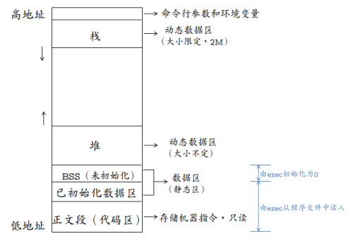
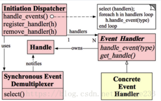
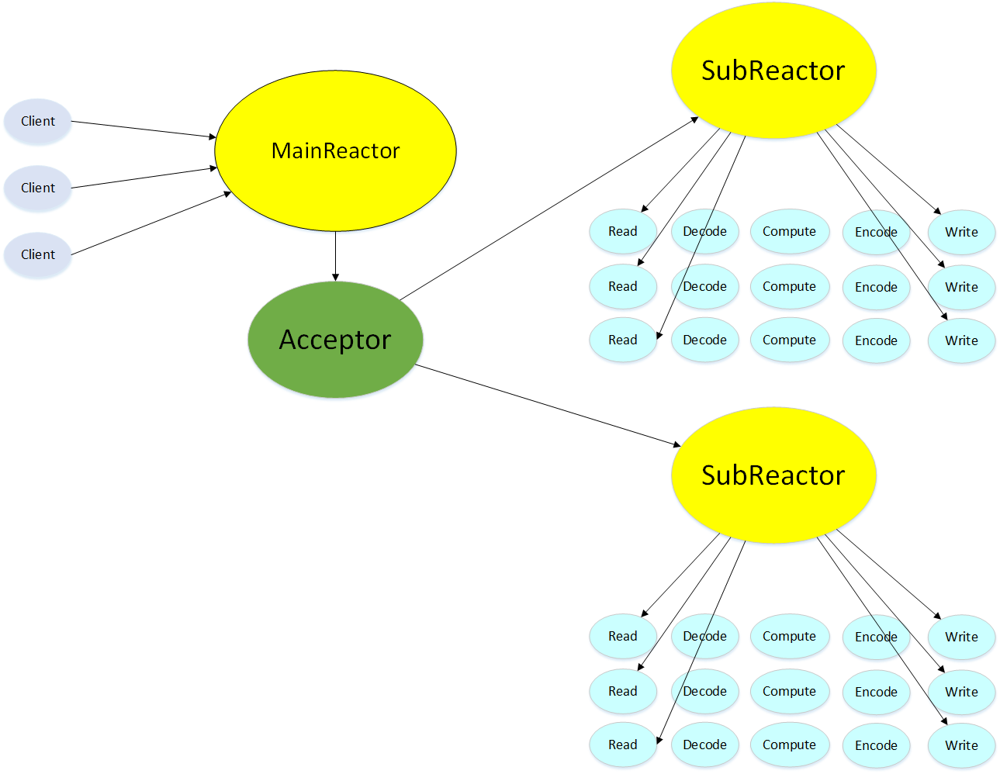

我叫唐颖琛，来自华南理工大学软件学院大三学生，目前主要使用c++语言，也了解过java，golang以及python语言。最近在读C++11特性，Linux多线程服务端编程，高性能服务器。除此之外，大学生活中还参加了一个隐蔽信道科研项目，以及数学建模竞赛，获得亚太杯一等奖，

我觉得我喜欢专研，能够独立解决问题，具有较强的自学能力。同时我喜欢团队合作，乐于助人，能够快速适应新环境


# Q&A

## C++基础知识
#### 重载与重写
重载：两个函数名相同，但是参数列表不同（个数，类型），返回值类型没有要求，在同一作用域中·
重写：子类继承了父类，父类中的函数是虚函数，在子类中重新定义了这个虚函数，这种情况是重写


#### static 关键字

1. 全局静态变量

静态存储区，在整个程序运行期间一直存在。

初始化：未经初始化的全局静态变量会被自动初始化为0（自动对象的值是任意的，除非他被显式初始化）；

作用域：全局静态变量在声明他的文件之外是不可见的，准确地说是从定义之处开始，到文件结尾。

2. 局部静态变量

内存中的位置：静态存储区

初始化：未经初始化的全局静态变量会被自动初始化为0（自动对象的值是任意的，除非他被显式初始化）；

作用域：作用域仍为局部作用域，当定义它的函数或者语句块结束的时候，作用域结束。但是当局部静态变量离开作用域后，并没有销毁，而是仍然驻留在内存当中，只不过我们不能再对它进行访问，直到该函数再次被调用，并且值不变；

3. 静态函数

函数的定义和声明在默认情况下都是extern的，但静态函数只是在声明他的文件当中可见，不能被其他文件所用。

函数的实现使用static修饰，那么这个函数只可在本cpp内使用，不会同其他cpp中的同名函数引起冲突；

warning：不要再头文件中声明static的全局函数，不要在cpp内声明非static的全局函数，如果你要在多个cpp中复用该函数，就把它的声明提到头文件里去，否则cpp内部声明需加上static修饰；

4. 类的静态成员

在类中，静态成员可以实现多个对象之间的数据共享，并且使用静态数据成员还不会破坏隐藏的原则，即保证了安全性。因此，静态成员是类的所有对象中共享的成员，而不是某个对象的成员。对多个对象来说，静态数据成员只存储一处，供所有对象共用。

**static静态成员变量不能在类的内部初始化**。在类的内部只是声明，定义必须在类定义体的外部，通常在类的实现文件中初始化，如：double Account::Rate = 2.25;static关键字只能用于类定义体内部的声明中，定义时不能标示为static

5. 类的静态函数

静态成员函数和静态数据成员一样，它们都属于类的静态成员，它们都不是对象成员。因此，对静态成员的引用不需要用对象名。

**static成员函数主要目的是作为类作用域的全局函数**。不能访问类的非静态数据成员。类的静态成员函数没有this指针，这导致：1、不能直接存取类的非静态成员变量，调用非静态成员函数2、不能被声明为virtual

。如果静态成员函数中要引用非静态成员时，可通过对象来引用。从中可看出，调用静态成员函数使用如下格式：<类名>::<静态成员函数名>(<参数表>);


####  const 关键字

定义常量

**(1)const修饰变量**，以下两种定义形式在本质上是一样的。它的含义是：const修饰的类型为TYPE的变量value是不可变的。

TYPE const ValueName = value;
const TYPE ValueName = value;

**(2)将const改为外部连接**, 作用于扩大至全局, 编译时会分配内存, 并且可以不进行初始化, 仅仅作为声明, 编译器认为在程序其他地方进行了定义.

```c++
extend const int ValueName = value;
```

**指针使用CONST**

(1)指针本身是常量不可变
**char* const** pContent;

(2)指针所指向的内容是常量不可变
**const char ***pContent;

(3)两者都不可变
**const char* const** pContent;

(4)还有其中区别方法，沿着\*号划一条线：
如果const位于\*的左侧，则const就是用来修饰指针所指向的变量，即指针指向为常量；
如果const位于\*的右侧，const就是修饰指针本身，即指针本身是常量。

**函数中使用CONST**

**(1)const修饰函数参数**
a.传递过来的参数在函数内不可以改变(无意义，因为Var本身就是形参)

`void function(const int Var);`

b.参数指针所指内容为常量不可变

`void function(const char* Var);`

c.参数指针本身为常量不可变(也无意义，因为char* Var也是形参)

`void function(char* const Var);`

d.参数为引用，为了增加效率同时防止修改。修饰引用参数时：

`void function(const Class& Var);//引用参数在函数内不可以改变`

`void function(const TYPE& Var); //引用参数在函数内为常量不可变`

这样的一个const引用传递和最普通的函数按值传递的效果是一模一样的,他禁止对引用的对象的一切修改,唯一不同的是按值传递会先建立一个类对象的副本, 然后传递过去,而它直接传递地址,所以这种传递比按值传递更有效.另外只有引用的const传递可以传递一个临时对象,因为临时对象都是const属性, 且是不可见的,他短时间存在一个局部域中,所以不能使用指针,只有引用的const传递能够捕捉到这个家伙.

**(2)const 修饰函数返回值**
const修饰函数返回值其实用的并不是很多，它的含义和const修饰普通变量以及指针的含义基本相同。
a. `const int fun1() //这个其实无意义，因为参数返回本身就是赋值。`
b. `const int * fun2() //调用时 const int *pValue = fun2();`
//我们可以把fun2()看作成一个变量，即指针内容不可变。
c. `int* const fun3() //调用时 int * const pValue = fun2();`
//我们可以把fun2()看作成一个变量，即指针本身不可变。

一般情况下，函数的返回值为某个对象时，如果将其声明为const时，多用于操作符的重载。通常，不建议用const修饰函数的返回值类型为某个对象或对某个对象引用的情况。原因如下：如果返回值为某个对象为const（const A test = A 实例）或某个对象的引用为const（const A& test = A实例） ，则返回值具有const属性，则返回实例只能访问类A中的公有（保护）数据成员和const成员函数，并且不允许对其进行赋值操作，这在一般情况下很少用到。

**类相关CONST**

**const数据成员的初始化只能在类的构造函数的初始化列表中进行**。要想建立在整个类中都恒定的常量，应该用类中的枚举常量来实现，或者static const。

**(1)const修饰成员变量**
const修饰类的成员函数，表示成员常量，不能被修改，同时它只能在初始化列表中赋值。

```c++
class A
{
…
const int nValue; //成员常量不能被修改
…
A(int x): nValue(x) { } ; //只能在初始化列表中赋值
}
```

**(2)const修饰成员函数**
const修饰类的成员函数，则该成员函数不能修改类中任何非const成员函数。一般写在函数的最后来修饰。

```c++
class A
{
…
void function()const; //常成员函数, 它不改变对象的成员变量.

//也不能调用类中任何非const成员函数。
}
```

对于const类对象/指针/引用，只能调用类的const成员函数，因此，const修饰成员函数的最重要作用就是限制对于const对象的使用。

a. const成员函数不被允许修改它所在对象的任何一个数据成员。

b. const成员函数能够访问对象的const成员，而其他成员函数不可以。

**(3)const修饰类对象/对象指针/对象引用**

· const修饰类对象表示该对象为常量对象，其中的任何成员都不能被修改。对于对象指针和对象引用也是一样。

· const修饰的对象，该对象的任何非const成员函数都不能被调用，因为任何非const成员函数会有修改成员变量的企图。
例如：

```c++
class AAA
{
void func1();
void func2() const;
}
const AAA aObj;
aObj.func1(); ×
aObj.func2(); 正确

const AAA* aObj = new AAA();
aObj-> func1(); ×
aObj-> func2(); 正确
```


**将Const类型转化为非Const类型的方法**

采用const_cast 进行转换。
用法：const_cast (expression)
该运算符用来修改类型的const或volatile属性。除了const 或volatile修饰之外， type_id和expression的类型是一样的。

· 常量指针被转化成非常量指针，并且仍然指向原来的对象；

· 常量引用被转换成非常量引用，并且仍然指向原来的对象；

· 常量对象被转换成非常量对象。

**使用const的一些建议**

· 要大胆的使用const，这将给你带来无尽的益处，但前提是你必须搞清楚原委；
· 要避免最一般的赋值操作错误，如将const变量赋值，具体可见思考题；
· 在参数中使用const应该使用引用或指针，而不是一般的对象实例，原因同上；
· const在成员函数中的三种用法（参数、返回值、函数）要很好的使用；
· 不要轻易的将函数的返回值类型定为const;
· 除了重载操作符外一般不要将返回值类型定为对某个对象的const引用;
· 任何不会修改数据成员的函数都应该声明为const 类型。

**补充重要说明**

· 类内部的常量限制：使用这种类内部的初始化语法的时候，常量必须是被一个常量表达式

初始化的整型或枚举类型，而且必须是static和const形式。

· 如何初始化类内部的常量：一种方法就是static 和 const 并用，在外部初始化，例如：

```c++
class A { 
public: 
	A() {} 
private: 
	static const int i;//注意必须是静态的！ 
}；
const int A::i=3;另一个很常见的方法就是初始化列表： 

class A {
public: 
	A(int i=0):test(i) {} 
private: 
	const int i;
}；
```

 还有一种方式就是在外部初始化，

· 如果在非const成员函数中，this指针只是一个类类型的；如果在const成员函数中，

this指针是一个const类类型的；如果在volatile成员函数中,this指针就是一个

volatile类类型的。

· new返回的指针必须是const类型的。


#### auto 关键字

auto特性:
1.auto不能作为函数参数
2.auto不能直接声明数组
3. 为了避免与C++98中的auto发生混淆，C++11只保留了auto作为类型指示符的用法
4. auto在实际中最常见的优势用法就是跟以后会讲到的C++11提供的新式for循环，还有lambda表达式等进行配合使用。
5. auto不能定义类的非静态成员变量
6. 实例化模板时不能使用auto作为模板参数

#### new/delete与malloc/free的区别是什么

首先，new/delete是C++的关键字，而malloc/free是C语言的库函数，后者使用必须指明申请内存空间的大小，返回的指针需要强转。对于类类型的对象，后者不会调用构造函数和析构函数，不用指定内存大小，返回的指针不用强转。

**从本质上来说**，malloc是C中的函数，需要声明特定的头文件。而new是C++中的关键字(操作符)，它本身不是函数，所以不依赖于头文件，C++译器就可以把new编译成目标代码(还会根据参数的类型插入相应的构造函数)。

**从使用上来说**，如下几点不同：

- new和delete是操作符，可以重载，只能在C++中使用。而malloc，free是函数，可以覆盖，C、C++中都可以使用。
- new可以自动计算所需要的字节大小。而malloc必须人为的计算出所需要的字节数。在Linux中可以有这样：malloc(0),这是因为Linux中malloc有一个下限值16Bytes，注意malloc(-1)是禁止的，但是在某些系统中是不允许malloc(0)的。
- 分配内存成功的话，new返回指定类型的指针。而malloc返回void指针，可以在返回后强行转换为实际类型的指针。
- 分配内存失败时，new会throw一个异常std::bad_alloc。而malloc会返回空指针。
- new可以调用对象的构造函数，对应的delete调用相应的析构函数。而malloc仅仅分配内存，free仅仅回收内存，并不执行构造函数和析构函数。


#### 请你说一说strcpy和strlen

strcpy是字符串拷贝函数，原型：

char *strcpy(char* dest, const char *src);

从src逐字节拷贝到dest，直到遇到'\0'结束，因为没有指定长度，可能会导致拷贝越界，造成缓冲区溢出漏洞,安全版本是strncpy函数。
strlen函数是计算字符串长度的函数，返回从开始到'\0'之间的字符个数。

#### 虚函数和多态

多态的实现主要分为静态多态和动态多态，

**静态多态**

主要是重载，在编译的时候就已经确定；


**动态多态**

是用虚函数机制实现的，在运行期间动态绑定。举个例子：一个父类类型的指针指向一个子类对象时候，使用父类的指针去调用子类中重写了的父类中的虚函数的时候，会调用子类重写过后的函数，在父类中声明为加了virtual关键字的函数，在子类中重写时候不需要加virtual也是虚函数。


**虚函数的实现**

在有虚函数的类中，类的最开始部分是一个虚函数表的指针，这个指针指向一个虚函数表，表中放了虚函数的地址，实际的虚函数在代码段(.text)中。当子类继承了父类的时候也会继承其虚函数表，当子类重写父类中虚函数时候，会将其继承到的虚函数表中的地址替换为重新写的函数地址。使用了虚函数，会增加访问内存开销，降低效率。


**构造函数不能为虚函数**

**1. 存储空间角度：**虚函数对应一个vtable，vtable存储于对象的内存空间

若构造函数是虚的，则需要通过 vtable来调用，若对象还未实例化，即内存空间还没有，无法找到vtable

**2. 使用角度：虚函数主要用于在信息不全的情况下，能使重载的函数得到对应的调用。**

构造函数本身就是要初始化实例，那使用虚函数就没有实际意义

**3. 从实际含义上看**，在调用构造函数时还不能确定对象的真实类型（因为子类会调父类的构造函数）；而且构造函数的作用是提供初始化，在对象生命期只执行一次，不是对象的动态行为，也没有太大的必要成为虚函数


**析构函数必须是虚函数，C++默认的析构函数不是虚函数**

将可能会被继承的父类的析构函数设置为虚函数，可以保证当我们new一个子类，然后使用基类指针指向该子类对象，释放基类指针时可以释放掉子类的空间，防止内存泄漏。


C++默认的析构函数不是虚函数是因为虚函数需要额外的虚函数表和虚表指针，占用额外的内存。而对于不会被继承的类来说，其析构函数如果是虚函数，就会浪费内存。因此C++默认的析构函数不是虚函数，而是只有当需要当作父类时，设置为虚函数。


#### 写个函数在main函数执行前先运行
```
__attribute((constructor))void before()
{
    printf("before main\n");
```

#### 智能指针shared_ptr的实现
```
template <typename T>
class SmartPtr{
private:
	T *ptr;
	int *use_count;
public:
	SmartPtr(T *p);////SmartPtr<int>p(new int(2));
	SmartPtr(const SmartPtr<T>&orig);//SmartPtr<int>q(p);
	SmartPtr<T>&operator=(const SmartPtr<T> &rhs);//q=p
	~SmartPtr();
	T operator*();  //为了能把智能指针当成普通指针操作定义解引用操作
	T*operator->();  //定义取成员操作
	T* operator+(int i);//定义指针加一个常数
	int operator-(SmartPtr<T>&t1,SmartPtr<T>&t2);//定义两个指针相减
	void getcount() { return *use_count } }; 
	template <typename T> int SmartPtr<T>::operator-(SmartPtr<T> &t1, SmartPtr<T> &t2) { return t1.ptr-t2.ptr; } 
	template <typename T> SmartPtr<T>::SmartPtr(T *p) { 
		ptr=p; 
		try { 
			use_count=new int(1); 
		}catch (...) {
			delete ptr;
			ptr= nullptr; 
			delete use_count; 
			use_count= nullptr; 
		} 
	} 
	template <typename T> SmartPtr<T>::SmartOtr(const SmartPtr<T> &orig){//复制构造函数
        use_count=orig.use_count;//引用计数保存在一块内存，所有的SmarPtr对象的引用计数都指向这里
        this->ptr=orig.ptr;
        ++(*use_count);//当前对象的引用计数加1
	} 
	template <typename T> SmartPtr<T>& SmartPtr<T>::operator=(const SmartPtr<T> &rhs) {
	//重载=运算符，例如SmartPtr<int>p,q; p=q;这个语句中，首先给q指向的对象的引用计数加1，因为p重新指向了q所指的对象，所以p需要先给原来的对象的引用计数减1，如果减一后为0，先释放掉p原来指向的内存，然后讲q指向的对象的引用计数加1后赋值给p
		++*(rhs.use_count); 
		if((--*(use_count))==0) { 
			delete ptr; 
			ptr= nullptr; 
			delete use_count; 
			use_count= nullptr; 
		} 
		ptr=rhs.ptr; 
		*use_count=*(rhs.use_count);
        return *this; 
	} 
	template <typename T> SmartPtr<T>::~SmartPtr() { 
		getcount();
		if(--(*use_count)==0){  //SmartPtr的对象会在其生命周期结束的时候调用其析构函数，在析构函数中检测当前对象的引用计数是不是只有正在结束生命周期的这个SmartPtr引用，如果是，就释放掉，如果不是，就还有其他的SmartPtr引用当前对象，就等待其他的SmartPtr对象在其生命周期结束的时候调用析构函数释放掉
			getcount();
			delete ptr;
			ptr= nullptr;
			delete use_count;
			use_count=nullptr;
		}
	}
	template <typename T> T SmartPtr<T>::operator*(){
		return *ptr;
	}
	template <typename T> T*  SmartPtr<T>::operator->(){
		return ptr;
	}
	template <typename T> T* SmartPtr<T>::operator+(int i){
		T *temp=ptr+i;
		return temp;
	}
}
```


#### 隐式类型转换
首先，对于内置类型，低精度的变量给高精度变量赋值会发生隐式类型转换，其次，对于只存在单个参数的构造函数的对象构造来说，函数调用可以直接使用该参数传入，编译器会自动调用其构造函数生成临时对象

#### 类型转换
reinterpret_cast：可以用于任意类型的指针之间的转换，对转换的结果不做任何保证

dynamic_cast：这种其实也是不被推荐使用的，更多使用static_cast，dynamic本身只能用于存在虚函数的父子关系的强制类型转换，对于指针，转换失败则返回nullptr，对于引用，转换失败会抛出异常

const_cast：对于未定义const版本的成员函数，我们通常需要使用const_cast来去除const引用对象的const，完成函数调用。另外一种使用方式，结合static_cast，可以在非const版本的成员函数内添加const，调用完const版本的成员函数后，再使用const_cast去除const限定。

static_cast：完成基础数据类型；同一个继承体系中类型的转换；任意类型与空指针类型void* 之间的转换。

#### extern C
C++调用C函数时需要extern C, 因为C没有函数重载


#### Run Time Type Identification (RTTI）
运行时类型检查，在C++层面主要体现在dynamic_cast和typeid,VS中虚函数表的-1位置存放了指向type_info的指针。对于存在虚函数的类型，typeid和dynamic_cast都会去查询type_info

####  请你说说C语言是怎么进行函数调用的？
每一个函数调用都会分配函数栈，在栈内进行函数执行过程。调用前，先把返回地址压栈，然后把当前函数的esp指针压栈。

#### STL

STL主要由：以下几部分组成：
容器 迭代器 仿函数 算法 分配器 配接器
他们之间的关系：分配器给容器分配存储空间，算法通过迭代器获取容器中的内容，仿函数可以协助算法完成各种操作，配接器用来套接适配仿函数


set, multiset, map, multimap **RBTree**

unordered_~ **hash table**

priority_queue **heap**


##### map和set

map和set都是C++的关联容器，其底层实现都是红黑树（RB-Tree）。由于 map 和set所开放的各种操作接口，RB-tree 也都提供了，所以几乎所有的 map 和set的操作行为，都只是转调 RB-tree 的操作行为。

map和set区别在于：

（1）map中的元素是key-value（关键字—值）对：关键字起到索引的作用，值则表示与索引相关联的数据；Set与之相对就是关键字的简单集合，set中每个元素只包含一个关键字。

（2）set的迭代器是const的，不允许修改元素的值；map允许修改value，但不允许修改key。其原因是因为map和set是根据关键字排序来保证其有序性的，如果允许修改key的话，那么首先需要删除该键，然后调节平衡，再插入修改后的键值，调节平衡，如此一来，严重破坏了map和set的结构，导致iterator失效，不知道应该指向改变前的位置，还是指向改变后的位置。所以STL中将set的迭代器设置成const，不允许修改迭代器的值；而map的迭代器则不允许修改key值，允许修改value值。

（3）map支持下标操作，set不支持下标操作。map可以用key做下标，map的下标运算符[ ]将关键码作为下标去执行查找，如果关键码不存在，则插入一个具有该关键码和mapped_type类型默认值的元素至map中，因此下标运算符[ ]在map应用中需要慎用，const_map不能用，只希望确定某一个关键值是否存在而不希望插入元素时也不应该使用，mapped_type类型没有默认值也不应该使用。如果find能解决需要，尽可能用find。

##### map, unordered_map 和 Multimap

1、Map映射，map 的所有元素都是 pair，同时拥有实值（value）和键值（key）。pair 的第一元素被视为键值，第二元素被视为实值。所有元素都会根据元素的键值自动被排序。不允许键值重复。

底层实现：红黑树

适用场景：有序键值对不重复映射

2、Multimap

多重映射。multimap 的所有元素都是 pair，同时拥有实值（value）和键值（key）。pair 的第一元素被视为键值，第二元素被视为实值。所有元素都会根据元素的键值自动被排序。允许键值重复。

底层实现：红黑树

适用场景：有序键值对可重复映射


##### vector 和 list

1、概念：

1）Vector

连续存储的容器，动态数组，在堆上分配空间

底层实现：数组

两倍容量增长：

vector 增加（插入）新元素时，如果未超过当时的容量，则还有剩余空间，那么直接添加到最后（插入指定位置），然后调整迭代器。

如果没有剩余空间了，则会重新配置原有元素个数的两倍空间，然后将原空间元素通过复制的方式初始化新空间，再向新空间增加元素，最后析构并释放原空间，之前的迭代器会失效。

性能：

访问：O(1)

插入：在最后插入（空间够）：很快

在最后插入（空间不够）：需要内存申请和释放，以及对之前数据进行拷贝。

在中间插入（空间够）：内存拷贝

在中间插入（空间不够）：需要内存申请和释放，以及对之前数据进行拷贝。

删除：在最后删除：很快

在中间删除：内存拷贝

适用场景：经常随机访问，且不经常对非尾节点进行插入删除。

2、List

动态链表，在堆上分配空间，每插入一个元数都会分配空间，每删除一个元素都会释放空间。

底层：双向链表

性能：

访问：随机访问性能很差，只能快速访问头尾节点。

插入：很快，一般是常数开销

删除：很快，一般是常数开销

适用场景：经常插入删除大量数据

2、区别：

1）vector底层实现是数组；list是双向 链表。

2）vector支持随机访问，list不支持。

3）vector是顺序内存，list不是。

4）vector在中间节点进行插入删除会导致内存拷贝，list不会。

5）vector一次性分配好内存，不够时才进行2倍扩容；list每次插入新节点都会进行内存申请。

6）vector随机访问性能好，插入删除性能差；list随机访问性能差，插入删除性能好。

3、应用

vector拥有一段连续的内存空间，因此支持随机访问，如果需要高效的随即访问，而不在乎插入和删除的效率，使用vector。

list拥有一段不连续的内存空间，如果需要高效的插入和删除，而不关心随机访问，则应使用list。


##### deque
1.特点：

(1) deque(double-ended queue 双端队列);

(2) 具有分段数组、索引数组,  **分段**数组是存储数据的，**索引**数组是存储每段数组的首地址;

(3) 向两端插入元素效率较高！

(若向两端插入元素，如果两端的分段数组未满，既可插入;如果两端的分段数组已满，

则创建新的分段函数，并把分段数组的首地址存储到deque容器中即可)。

中间插入元素效率较低！


##### STL的allocaotr

STL的分配器用于封装STL容器在内存管理上的底层细节。在C++中，其内存配置和释放如下：

new运算分两个阶段：(1)调用::operator new配置内存;(2)调用对象构造函数构造对象内容

delete运算分两个阶段：(1)调用对象希构函数；(2)掉员工::operator delete释放内存

为了精密分工，STL allocator将两个阶段操作区分开来：内存配置有alloc::allocate()负责，内存释放由alloc::deallocate()负责；对象构造由::construct()负责，对象析构由::destroy()负责。

同时为了提升内存管理的效率，减少申请小内存造成的内存碎片问题，SGI STL采用了两级配置器，当分配的空间大小超过128B时，会使用第一级空间配置器；当分配的空间大小小于128B时，将使用第二级空间配置器。第一级空间配置器直接使用malloc()、realloc()、free()函数进行内存空间的分配和释放，而第二级空间配置器采用了内存池技术，通过空闲链表来管理内存。


##### STL迭代器删除元素

这个主要考察的是迭代器失效的问题。1.对于序列容器vector,deque来说，使用erase(itertor)后，后边的每个元素的迭代器都会失效，但是后边每个元素都会往前移动一个位置，但是erase会返回下一个有效的迭代器；2.对于关联容器map set来说，使用了erase(iterator)后，当前元素的迭代器失效，但是其结构是红黑树，删除当前元素的，不会影响到下一个元素的迭代器，所以在调用erase之前，记录下一个元素的迭代器即可。3.对于list来说，它使用了不连续分配的内存，并且它的erase方法也会返回下一个有效的iterator，因此上面两种正确的方法都可以使用。


### 编译与底层

#### 源码到可执行文件的过程

1）预编译

主要处理源代码文件中的以“#”开头的预编译指令。处理规则见下

1、删除所有的#define，展开所有的宏定义。

2、处理所有的条件预编译指令，如“#if”、“#endif”、“#ifdef”、“#elif”和“#else”。

3、处理“#include”预编译指令，将文件内容替换到它的位置，这个过程是递归进行的，文件中包含其他文件。

4、删除所有的注释，“//”和“/**/”。

5、保留所有的#pragma 编译器指令，编译器需要用到他们，如：#pragma once 是为了防止有文件被重复引用。

6、添加行号和文件标识，便于编译时编译器产生调试用的行号信息，和编译时产生编译错误或警告是能够显示行号。

2）编译

把预编译之后生成的xxx.i或xxx.ii文件，进行一系列词法分析、语法分析、语义分析及优化后，生成相应的汇编代码文件。

1、词法分析：利用类似于“有限状态机”的算法，将源代码程序输入到扫描机中，将其中的字符序列分割成一系列的记号。

2、语法分析：语法分析器对由扫描器产生的记号，进行语法分析，产生语法树。由语法分析器输出的语法树是一种以表达式为节点的树。

3、语义分析：语法分析器只是完成了对表达式语法层面的分析，语义分析器则对表达式是否有意义进行判断，其分析的语义是静态语义——在编译期能分期的语义，相对应的动态语义是在运行期才能确定的语义。

4、优化：源代码级别的一个优化过程。

5、目标代码生成：由代码生成器将中间代码转换成目标机器代码，生成一系列的代码序列——汇编语言表示。

6、目标代码优化：目标代码优化器对上述的目标机器代码进行优化：寻找合适的寻址方式、使用位移来替代乘法运算、删除多余的指令等。

3）汇编

将汇编代码转变成机器可以执行的指令(机器码文件)。 汇编器的汇编过程相对于编译器来说更简单，没有复杂的语法，也没有语义，更不需要做指令优化，只是根据汇编指令和机器指令的对照表一一翻译过来，汇编过程有汇编器as完成。经汇编之后，产生目标文件(与可执行文件格式几乎一样)xxx.o(Windows下)、xxx.obj(Linux下)。

4）链接

将不同的源文件产生的目标文件进行链接，从而形成一个可以执行的程序。链接分为静态链接和动态链接：

1、静态链接：

函数和数据被编译进一个二进制文件。在使用静态库的情况下，在编译链接可执行文件时，链接器从库中复制这些函数和数据并把它们和应用程序的其它模块组合起来创建最终的可执行文件。

空间浪费：因为每个可执行程序中对所有需要的目标文件都要有一份副本，所以如果多个程序对同一个目标文件都有依赖，会出现同一个目标文件都在内存存在多个副本；

更新困难：每当库函数的代码修改了，这个时候就需要重新进行编译链接形成可执行程序。

运行速度快：但是静态链接的优点就是，在可执行程序中已经具备了所有执行程序所需要的任何东西，在执行的时候运行速度快。

2、动态链接：

动态链接的基本思想是把程序按照模块拆分成各个相对独立部分，在程序运行时才将它们链接在一起形成一个完整的程序，而不是像静态链接一样把所有程序模块都链接成一个单独的可执行文件。

共享库：就是即使需要每个程序都依赖同一个库，但是该库不会像静态链接那样在内存中存在多分，副本，而是这多个程序在执行时共享同一份副本；

更新方便：更新时只需要替换原来的目标文件，而无需将所有的程序再重新链接一遍。当程序下一次运行时，新版本的目标文件会被自动加载到内存并且链接起来，程序就完成了升级的目标。

性能损耗：因为把链接推迟到了程序运行时，所以每次执行程序都需要进行链接，所以性能会有一定损失。


#### C++内存结构



一个程序本质上都是由BSS段、data段、text段三个组成的。可以看到一个可执行程序在存储（没有调入内存）时分为代码段、数据区和未初始化数据区三部分。

##### .BSS（未初始化数据区）

通常用来存放程序中未初始化的全局变量和静态变量的一块内存区域。BSS段属于静态分配，程序结束后静态变量资源由系统自动释放。

##### .data： 

也有的地方叫GVAR(global value)，用来存放程序中**已经初始化**的非零全局变量。静态分配。

- data又可分为读写（RW）区域和只读（RO）区域。 
  -> RO段保存常量所以也被称为`.constdata` eg const数据
  -> RW段则是普通非常全局变量，静态变量就在其中

##### .text

也称为代码段(Code)，用来存放程序执行代码，同时也可能会包含一些常量(如一些字符串常量等）。这部分区域的大小在程序运行前就已经确定，并且内存区域属于只读(某些架构可能允许修改)。在代码段中，也有可能包含一些只读的常数变量。 
这块内存是共享的,当有多个相同进程(Process)存在时，共用同一个text段。


text段和data段在编译时已经分配了空间，而BSS段并不占用可执行文件的大小，它是由链接器来获取内存的。

bss段（未进行初始化的数据）的内容并不存放在磁盘上的程序文件中。其原因是内核在程序开始运行前将它们设置为0。需要存放在程序文件中的只有正文段和初始化数据段。

data段（已经初始化的数据）则为数据分配空间，数据保存到目标文件中。

数据段包含经过初始化的全局变量以及它们的值。BSS段的大小从可执行文件中得到，然后链接器得到这个大小的内存块，紧跟在数据段的后面。当这个内存进入程序的地址空间后全部清零。包含数据段和BSS段的整个区段此时通常称为数据区。

可执行程序在运行时又多出两个区域：栈区和堆区。

栈区：由编译器自动释放，存放函数的参数值、局部变量等。每当一个函数被调用时，该函数的返回类型和一些调用的信息被存放到栈中。然后这个被调用的函数再为他的自动变量和临时变量在栈上分配空间。每调用一个函数一个新的栈就会被使用。栈区是从高地址位向低地址位增长的，是一块连续的内存区域，最大容量是由系统预先定义好的，申请的栈空间超过这个界限时会提示溢出，用户能从栈中获取的空间较小。

堆区：用于动态分配内存，位于BSS和栈中间的地址区域。由程序员申请分配和释放。堆是从低地址位向高地址位增长，采用链式存储结构。频繁的malloc/free造成内存空间的不连续，产生碎片。当申请堆空间时库函数是按照一定的算法搜索可用的足够大的空间。因此堆的效率比栈要低的多。

##### A* a = new A; a->i = 10：

1）A *a：a是一个局部变量，类型为指针，故而操作系统在程序栈区开辟4/8字节的空间（0x000m），分配给指针a。

2）new A：通过new动态的在堆区申请类A大小的空间（0x000n）。

3）a = new A：将指针a的内存区域填入栈中类A申请到的地址的地址。即*（0x000m）=0x000n。

4）a->i：先找到指针a的地址0x000m，通过a的值0x000n和i在类a中偏移offset，得到a->i的地址0x000n + offset，进行*(0x000n + offset) = 10的赋值操作，即内存0x000n + offset的值是10。


#### 堆和栈的区别？堆和栈哪个运行比较快？为什么？

区别

* 申请方式：
  stack：系统分配

  heap：自己申请并指明大小

* 系统响应

  栈：只要栈的剩余空间大于所申请空间，系统将为程序提供内存，否则将报异常提示栈溢出。
  堆：操作系统有一个记录空闲内存地址的链表，当系统收到程序的申请时，会遍历该链表，寻找第一个空间大于所申请空间的堆结点，然后将该结点从空闲结点链表中删除，并将该结点的空间分配给程序。
  对于大多数系统，会在这块内存空间中的首地址处记录本次分配的大小，这样，代码中的 delete 语句才能正确的释放本内存空间。
  由于找到的堆结点的大小不一定正好等于申请的大小，系统会自动的将多余的那部分重新放入空闲链表中。

* 申请大小限制

  栈：Windows下，栈是向低地址扩展的数据结构，是一块连续的内存的区域。意思是栈顶的地址和栈的最大容量是系统预先规定好的，在Windows下，栈的大小是 2M （也有的说是 1M ，总之是一个编译时就确定的常数），如果申请的空间超过栈的剩余空间时，将提示overflow。因此，能从栈获得的空间较小。
  堆：堆是向高地址扩展的数据结构，是不连续的内存区域。这是由于系统是用链表来存储的空闲内存地址的，自然是不连续的，而链表的遍历方向是由低地址向高地址。堆的大小受限于计算机系统中有效的虚拟内存。由此可见，堆获得的空间比较灵活，也比较大。

* 申请效率

  栈：由系统自动分配，速度较快。但程序员是无法控制的 。
  堆：由 new 分配的内存，一般速度比较慢，而且容易产生内存碎片 , 不过用起来方便 。

* 堆和栈中的存储内容
  栈：在函数调用时，第一个进栈的是主函数中后的下一条指令（函数调用语句的下一条可执行语句）的地址，然后是函数的各个参数，在大多数的 C 编译器中，参数是由右往左入栈的，然后是函数中的局部变量。注意静态变量是不入栈的。
  当本次函数调用结束后，局部变量先出栈，然后是参数，最后栈顶指针指向最开始存的地址，也就是主函数中的下一条指令，程序由该点继续运行。
  堆：一般是在堆的头部用一个字节存放堆的大小。堆中的具体内容由程序员安排。

* 存取效率

  栈：编译时确定

  堆：运行时刻赋值


#### reactor模型组成
reactor模型要求主线程只负责监听文件描述上是否有事件发生，有的话就立即将该事件通知工作线程，除此之外，主线程不做任何其他实质性的工作，读写数据、接受新的连接以及处理客户请求均在工作线程中完成。其模型组成如下：

1）Handle：即操作系统中的句柄，是对资源在操作系统层面上的一种抽象，它可以是打开的文件、一个连接(Socket)、Timer等。由于Reactor模式一般使用在网络编程中，因而这里一般指Socket Handle，即一个网络连接。

2）Synchronous Event Demultiplexer（同步事件复用器）：阻塞等待一系列的Handle中的事件到来，如果阻塞等待返回，即表示在返回的Handle中可以不阻塞的执行返回的事件类型。这个模块一般使用操作系统的select来实现。

3）Initiation Dispatcher：用于管理Event Handler，即EventHandler的容器，用以注册、移除EventHandler等；另外，它还作为Reactor模式的入口调用Synchronous Event Demultiplexer的select方法以阻塞等待事件返回，当阻塞等待返回时，根据事件发生的Handle将其分发给对应的Event Handler处理，即回调EventHandler中的handle_event()方法。

4）Event Handler：定义事件处理方法：handle_event()，以供InitiationDispatcher回调使用。

5）Concrete Event Handler：事件EventHandler接口，实现特定事件处理逻辑。

#### 请自己设计一下如何采用单线程的方式处理高并发
在单线程模型中，可以采用I/O复用来提高单线程处理多个请求的能力，然后再采用事件驱动模型，基

于异步回调来处理事件来

#### 请你说一说C++ STL 的内存优化
1）二级配置器结构
STL内存管理使用二级内存配置器。
1、第一级配置器
第一级配置器以malloc()，free()，realloc()等C函数执行实际的内存配置、释放、重新配置等操作，并且能在内存需求不被满足的时候，调用一个指定的函数。
一级空间配置器分配的是大于128字节的空间
如果分配不成功，调用句柄释放一部分内存
如果还不能分配成功，抛出异常
2、第二级配置器
在STL的第二级配置器中多了一些机制，避免太多小区块造成的内存碎片，小额区块带来的不仅是内存碎片，配置时还有额外的负担。区块越小，额外负担所占比例就越大。
3、分配原则
如果要分配的区块大于128bytes，则移交给第一级配置器处理。
如果要分配的区块小于128bytes，则以内存池管理（memory pool），又称之次层配置（sub-allocation）：每次配置一大块内存，并维护对应的16个空闲链表（free-list）。下次若有相同大小的内存需求，则直接从free-list中取。如果有小额区块被释放，则由配置器回收到free-list中。
当用户申请的空间小于128字节时，将字节数扩展到8的倍数，然后在自由链表中查找对应大小的子链表
如果在自由链表查找不到或者块数不够，则向内存池进行申请，一般一次申请20块
如果内存池空间足够，则取出内存
如果不够分配20块，则分配最多的块数给自由链表，并且更新每次申请的块数
如果一块都无法提供，则把剩余的内存挂到自由链表，然后向系统heap申请空间，如果申请失败，则看看自由链表还有没有可用的块，如果也没有，则最后调用一级空间配置器

2）二级内存池
二级内存池采用了16个空闲链表，这里的16个空闲链表分别管理大小为8、16、24......120、128的数据块。这里空闲链表节点的设计十分巧妙，这里用了一个联合体既可以表示下一个空闲数据块（存在于空闲链表中）的地址，也可以表示已经被用户使用的数据块（不存在空闲链表中）的地址。

1、空间配置函数allocate
首先先要检查申请空间的大小，如果大于128字节就调用第一级配置器，小于128字节就检查对应的空闲链表，如果该空闲链表中有可用数据块，则直接拿来用（拿取空闲链表中的第一个可用数据块，然后把该空闲链表的地址设置为该数据块指向的下一个地址），如果没有可用数据块，则调用refill重新填充空间。
2、空间释放函数deallocate
首先先要检查释放数据块的大小，如果大于128字节就调用第一级配置器，小于128字节则根据数据块的大小来判断回收后的空间会被插入到哪个空闲链表。
3、重新填充空闲链表refill
在用allocate配置空间时，如果空闲链表中没有可用数据块，就会调用refill来重新填充空间，新的空间取自内存池。缺省取20个数据块，如果内存池空间不足，那么能取多少个节点就取多少个。
从内存池取空间给空闲链表用是chunk_alloc的工作，首先根据end_free-start_free来判断内存池中的剩余空间是否足以调出nobjs个大小为size的数据块出去，如果内存连一个数据块的空间都无法供应，需要用malloc取堆中申请内存。
假如山穷水尽，整个系统的堆空间都不够用了，malloc失败，那么chunk_alloc会从空闲链表中找是否有大的数据块，然后将该数据块的空间分给内存池（这个数据块会从链表中去除）。
3、总结：
1. 使用allocate向内存池请求size大小的内存空间，如果需要请求的内存大小大于128bytes，直接使用malloc。
2. 如果需要的内存大小小于128bytes，allocate根据size找到最适合的自由链表。
a. 如果链表不为空，返回第一个node，链表头改为第二个node。
b. 如果链表为空，使用blockAlloc请求分配node。
x. 如果内存池中有大于一个node的空间，分配竟可能多的node(但是最多20个)，将一个node返回，其他的node添加到链表中。
y. 如果内存池只有一个node的空间，直接返回给用户。
z. 若果如果连一个node都没有，再次向操作系统请求分配内存。
①分配成功，再次进行b过程。
②分配失败，循环各个自由链表，寻找空间。
I. 找到空间，再次进行过程b。
II. 找不到空间，抛出异常。
3. 用户调用deallocate释放内存空间，如果要求释放的内存空间大于128bytes，直接调用free。
4. 否则按照其大小找到合适的自由链表，并将其插入。


#### C++如何内存泄漏

- 内存泄漏指的是由于疏忽或错误造成了程序未能释放掉不再使用的内存。


##### 内存泄漏排查

BoundsChecker,定位运行时发生的各种错误
调试运行DEBUG版程序，运用以下技术：CRT(C run-time libraries)、运行时函数调用堆栈、内存泄漏时提示的内存分配序号(集成开发环境OUTPUT窗口)，综合分析内存泄漏的原因，排除内存泄漏。
linux工具之检测内存泄漏-valgrind,功能强大，不仅仅是内存泄漏检测工具。


##### 解决

智能指针。因为智能指针可以自动删除分配的内存。智能指针和普通指针类似，只是不需要手动释放指针，而是通过智能指针自己管理内存的释放。


## 计算机网络

### TCP UDP 相关

#### 说一下TCP怎么保证可靠性
TCP保证可靠性：
（1）序列号、确认应答、超时重传

数据到达接收方，接收方需要发出一个确认应答，表示已经收到该数据段，并且确认序号会说明了它下一次需要接收的数据序列号。如果发送发迟迟未收到确认应答，那么可能是发送的数据丢失，也可能是确认应答丢失，这时发送方在等待一定时间后会进行重传。这个时间一般是2*RTT(报文段往返时间）+一个偏差值。

（2）窗口控制与高速重发控制/快速重传（重复确认应答）

TCP会利用窗口控制来提高传输速度，意思是在一个窗口大小内，不用一定要等到应答才能发送下一段数据，窗口大小就是无需等待确认而可以继续发送数据的最大值。如果不使用窗口控制，每一个没收到确认应答的数据都要重发。

使用窗口控制，如果数据段1001-2000丢失，后面数据每次传输，确认应答都会不停地发送序号为1001的应答，表示我要接收1001开始的数据，发送端如果收到3次相同应答，就会立刻进行重发；但还有种情况有可能是数据都收到了，但是有的应答丢失了，这种情况不会进行重发，因为发送端知道，如果是数据段丢失，接收端不会放过它的，会疯狂向它提醒......

（3）拥塞控制

如果把窗口定的很大，发送端连续发送大量的数据，可能会造成网络的拥堵（大家都在用网，你在这狂发，吞吐量就那么大，当然会堵），甚至造成网络的瘫痪。所以TCP在为了防止这种情况而进行了拥塞控制。

慢启动：定义拥塞窗口，一开始将该窗口大小设为1，之后每次收到确认应答（经过一个rtt），将拥塞窗口大小*2。

拥塞避免：设置慢启动阈值，一般开始都设为65536。拥塞避免是指当拥塞窗口大小达到这个阈值，拥塞窗口的值不再指数上升，而是加法增加（每次确认应答/每个rtt，拥塞窗口大小+1），以此来避免拥塞。

将报文段的超时重传看做拥塞，则一旦发生超时重传，我们需要先将阈值设为当前窗口大小的一半，并且将窗口大小设为初值1，然后重新进入慢启动过程。

快速重传：在遇到3次重复确认应答（高速重发控制）时，代表收到了3个报文段，但是这之前的1个段丢失了，便对它进行立即重传。

然后，先将阈值设为当前窗口大小的一半，然后将拥塞窗口大小设为慢启动阈值+3的大小。

这样可以达到：在TCP通信时，网络吞吐量呈现逐渐的上升，并且随着拥堵来降低吞吐量，再进入慢慢上升的过程，网络不会轻易的发生瘫痪。

#### TCP建立过程（三次握手，四次挥手）

TCP建立连接和断开连接的过程：


三次握手：

1. Client将标志位SYN置为1，随机产生一个值seq=J，并将该数据包发送给Server，Client进入SYN_SENT状态，等待Server确认。

2. Server收到数据包后由标志位SYN=1知道Client请求建立连接，Server将标志位SYN和ACK都置为1，ack=J+1，随机产生一个值seq=K，并将该数据包发送给Client以确认连接请求，Server进入SYN_RCVD状态。

3. Client收到确认后，检查ack是否为J+1，ACK是否为1，如果正确则将标志位ACK置为1，ack=K+1，并将该数据包发送给Server，Server检查ack是否为K+1，ACK是否为1，如果正确则连接建立成功，Client和Server进入ESTABLISHED状态，完成三次握手，随后Client与Server之间可以开始传输数据了。


四次挥手：7y     

由于TCP连接时全双工的，因此，每个方向都必须要单独进行关闭，这一原则是当一方完成数据发送任务后，发送一个FIN来终止这一方向的连接，收到一个FIN只是意味着这一方向上没有数据流动了，即不会再收到数据了，但是在这个TCP连接上仍然能够发送数据，直到这一方向也发送了FIN。首先进行关闭的一方将执行主动关闭，而另一方则执行被动关闭。

1.数据传输结束后，客户端的应用进程发出连接释放报文段，并停止发送数据，客户端进入FIN_WAIT_1状态，此时客户端依然可以接收服务器发送来的数据。

2.服务器接收到FIN后，发送一个ACK给客户端，确认序号为收到的序号+1，服务器进入CLOSE_WAIT状态。客户端收到后进入FIN_WAIT_2状态。

3.当服务器没有数据要发送时，服务器发送一个FIN报文，此时服务器进入LAST_ACK状态，等待客户端的确认

4.客户端收到服务器的FIN报文后，给服务器发送一个ACK报文，确认序列号为收到的序号+1。此时客户端进入TIME_WAIT状态，等待2MSL（MSL：报文段最大生存时间），然后关闭连接。

**三次握手原因：**

三次握手是为了防止，客户端的请求报文在网络滞留，客户端超时重传了请求报文，服务端建立连接，传输数据，释放连接之后，服务器又收到了客户端滞留的请求报文，建立连接一直等待客户端发送数据。

服务器对客户端的请求进行回应(第二次握手)后，就会理所当然的认为连接已建立，而如果客户端并没有收到服务器的回应呢？此时，客户端仍认为连接未建立，服务器会对已建立的连接保存必要的资源，如果大量的这种情况，服务器会崩溃。

**四次挥手原因**

1、当客户端确认发送完数据且知道服务器已经接收完了，想要关闭发送数据口（当然确认信号还是可以发），就会发FIN给服务器。

2、服务器收到客户端发送的FIN，表示收到了，就会发送ACK回复。

3、但这时候服务器可能还在发送数据，没有想要关闭数据口的意思，所以服务器的FIN与ACK不是同时发送的，而是等到服务器数据发送完了，才会发送FIN给客户端。

4、客户端收到服务器发来的FIN，知道服务器的数据也发送完了，回复ACK， 客户端等待2MSL以后，没有收到服务器传来的任何消息，知道服务器已经收到自己的ACK了，客户端就关闭链接，服务器也关闭链接了。

**2MSL意义**：

1、保证最后一次握手报文能到B，能进行超时重传。

2、2MSL后，这次连接的所有报文都会消失，不会影响下一次连接。


#### 说一说TCP的模型，状态转移

四层TCP/IP模型如下：


其状态转移图如下：


#### TCP通信接收数据不完整的解决方法

[TCP通信接收数据不完整的解决方法](https://blog.csdn.net/huoxingrenhdh/article/details/86617579)


#### TCP和UDP的区别

1、TCP与UDP区别总结：

* TCP面向连接 （如打电话要先拨号建立连接）; UDP是无连接 的，即发送数据之前不需要建立连接
* TCP提供可靠的服务。也就是说，通过TCP连接传送的数据，无差错，不丢失，不重复，且按序到达;UDP尽最大努力交付，即不保证可靠交付Tcp通过校验和，重传控制，序号标识，滑动窗口、确认应答实现可靠传输。如丢包时的重发控制，还可以对次序乱掉的分包进行顺序控制。
* UDP具有较好的实时性，工作效率比TCP高，适用于对高速传输和实时性有较高的通信或广播通信。
* 每一条TCP连接只能是点到点的;UDP支持一对一，一对多，多对一和多对多的交互通信
* TCP对系统资源要求较多，UDP对系统资源要求较少。


2、为什么UDP有时比TCP更有优势?

UDP以其简单、传输快的优势，在越来越多场景下取代了TCP,如实时游戏。

（1）网速的提升给UDP的稳定性提供可靠网络保障，丢包率很低，如果使用应用层重传，能够确保传输的可靠性。

（2）TCP为了实现网络通信的可靠性，使用了复杂的拥塞控制算法，建立了繁琐的握手过程，由于TCP内置的系统协议栈中，极难对其进行改进。

采用TCP，一旦发生丢包，TCP会将后续的包缓存起来，等前面的包重传并接收到后再继续发送，延时会越来越大，基于UDP对实时性要求较为严格的情况下，采用自定义重传机制，能够把丢包产生的延迟降到最低，尽量减少网络问题对游戏性造成影响。


### HTTP相关


#### http协议

1）HTTP协议：
HTTP协议是Hyper Text Transfer Protocol（超文本传输协议）的缩写，是用于从万维网（WWW:World Wide Web）服务器传输超文本到本地浏览器的传送协议。


HTTP是一个基于TCP/IP通信协议来传递数据（HTML 文件，图片文件，查询结果等）。

HTTP是一个属于应用层的面向对象的协议，由于其简捷、快速的方式，适用于分布式超媒体信息系统。它于1990年提出，经过几年的使用与发展，得到不断地完善和扩展。目前在WWW中使用的是HTTP/1.0的第六版，HTTP/1.1的规范化工作正在进行之中，而且HTTP-NG（Next Generation of HTTP）的建议已经提出。

HTTP协议工作于客户端-服务端架构为上。浏览器作为HTTP客户端通过URL向HTTP服务端即WEB服务器发送所有请求。Web服务器根据接收到的请求后，向客户端发送响应信息。

2）HTTP协议特点

1、简单快速：

客户向服务器请求服务时，只需传送请求方法和路径。请求方法常用的有GET、HEAD、POST。每种方法规定了客户与服务器联系的类型不同。由于HTTP协议简单，使得HTTP服务器的程序规模小，因而通信速度很快。

2、灵活：

HTTP允许传输任意类型的数据对象。正在传输的类型由Content-Type加以标记。

3、无连接：

无连接的含义是限制每次连接只处理一个请求。服务器处理完客户的请求，并收到客户的应答后，即断开连接。采用这种方式可以节省传输时间。

4、无状态：

HTTP协议是无状态协议。无状态是指协议对于事务处理没有记忆能力。缺少状态意味着如果后续处理需要前面的信息，则它必须重传，这样可能导致每次连接传送的数据量增大。另一方面，在服务器不需要先前信息时它的应答就较快。

5、支持B/S及C/S模式。

6、默认端口80

7、基于TCP协议

3）HTTP过程概述：

HTTP协议定义Web客户端如何从Web服务器请求Web页面，以及服务器如何把Web页面传送给客户端。HTTP协议采用了请求/响应模型。客户端向服务器发送一个请求报文，请求报文包含请求的方法、URL、协议版本、请求头部和请求数据。服务器以一个状态行作为响应，响应的内容包括协议的版本、成功或者错误代码、服务器信息、响应头部和响应数据。

HTTP 请求/响应的步骤如下：

1、客户端连接到Web服务器

一个HTTP客户端，通常是浏览器，与Web服务器的HTTP端口（默认为80）建立一个TCP套接字连接。例如，http://www.baidu.com。

2、发送HTTP请求

通过TCP套接字，客户端向Web服务器发送一个文本的请求报文，一个请求报文由请求行、请求头部、空行和请求数据4部分组成。

3、服务器接受请求并返回HTTP响应

Web服务器解析请求，定位请求资源。服务器将资源复本写到TCP套接字，由客户端读取。一个响应由状态行、响应头部、空行和响应数据4部分组成。

4、释放连接TCP连接

若connection 模式为close，则服务器主动关闭TCP连接，客户端被动关闭连接，释放TCP连接;若connection 模式为keepalive，则该连接会保持一段时间，在该时间内可以继续接收请求;

5、客户端浏览器解析HTML内容

客户端浏览器首先解析状态行，查看表明请求是否成功的状态代码。然后解析每一个响应头，响应头告知以下为若干字节的HTML文档和文档的字符集。客户端浏览器读取响应数据HTML，根据HTML的语法对其进行格式化，并在浏览器窗口中显示。

4、举例：

在浏览器地址栏键入URL，按下回车之后会经历以下流程：

1、浏览器向 DNS 服务器请求解析该 URL 中的域名所对应的 IP 地址；

2、解析出 IP 地址后，根据该 IP 地址和默认端口80，和服务器建立TCP连接；

3、浏览器发出读取文件（URL中域名后面部分对应的文件）的HTTP 请求，该请求报文作为 TCP 三次握手的第三个报文的数据发送给服务器；


4、服务器对浏览器请求作出响应，并把对应的 html 文本发送给浏览器；

5、释放 TCP连接；

6、浏览器将该 html 文本并显示内容；


#### HTTP和HTTPS的不同

HTTP协议和HTTPS协议区别如下：
1）HTTP协议是以明文的方式在网络中传输数据，而HTTPS协议传输的数据则是经过TLS加密后的，HTTPS具有更高的安全性

2）HTTPS在TCP三次握手阶段之后，还需要进行SSL 的handshake，协商加密使用的对称加密密钥

3）HTTPS协议需要服务端申请证书，浏览器端安装对应的根证书

4）HTTP协议端口是80，HTTPS协议端口是443

HTTPS优点：

HTTPS传输数据过程中使用密钥进行加密，所以安全性更高

HTTPS协议可以认证用户和服务器，确保数据发送到正确的用户和服务器

HTTPS缺点：

HTTPS握手阶段延时较高：由于在进行HTTP会话之前还需要进行SSL握手，因此HTTPS协议握手阶段延时增加

HTTPS部署成本高：一方面HTTPS协议需要使用证书来验证自身的安全性，所以需要购买CA证书；另一方面由于采用HTTPS协议需要进行加解密的计算，占用CPU资源较多，需要的服务器配置或数目高

#### HTTP返回码
HTTP协议的响应报文由状态行、响应头部和响应包体组成，其响应状态码总体描述如下：
1xx：指示信息--表示请求已接收，继续处理。

2xx：成功--表示请求已被成功接收、理解、接受。

3xx：重定向--要完成请求必须进行更进一步的操作。

4xx：客户端错误--请求有语法错误或请求无法实现。

5xx：服务器端错误--服务器未能实现合法的请求。

常见状态代码、状态描述的详细说明如下。

200 OK：客户端请求成功。

206 partial content服务器已经正确处理部分GET请求，实现断点续传或同时分片下载，该请求必须包含Range请求头来指示客户端期望得到的范围

300 multiple choices（可选重定向）:被请求的资源有一系列可供选择的反馈信息，由浏览器/用户自行选择其中一个。

301  moved permanently（永久重定向）：该资源已被永久移动到新位置，将来任何对该资源的访问都要使用本响应返回的若干个URI之一。

302 move temporarily(临时重定向)：请求的资源现在临时从不同的URI中获得，

304：not modified :如果客户端发送一个待条件的GET请求并且该请求以经被允许，而文档内容未被改变，则返回304,该响应不包含包体（即可直接使用缓存）。

403 Forbidden：服务器收到请求，但是拒绝提供服务。

404 Not Found：请求资源不存在，举个例子：输入了错误的URL。

#### OSI七层模型和TCP/IP四层模型，每层列举2个协议
OSI七层模型及其包含的协议如下:
物理层: 通过媒介传输比特,确定机械及电气规范,传输单位为bit，主要包括的协议为：IEE802.3 CLOCK RJ45

数据链路层: 将比特组装成帧和点到点的传递,传输单位为帧,主要包括的协议为MAC VLAN PPP

网络层：负责数据包从源到宿的传递和网际互连，传输单位为包,主要包括的协议为IP ARP ICMP

传输层：提供端到端的可靠报文传递和错误恢复，传输单位为报文,主要包括的协议为TCP UDP

会话层：建立、管理和终止会话，传输单位为SPDU，主要包括的协议为RPC NFS

表示层: 对数据进行翻译、加密和压缩,传输单位为PPDU，主要包括的协议为JPEG ASII

应用层: 允许访问OSI环境的手段,传输单位为APDU，主要包括的协议为FTP HTTP DNS

TCP/IP 4层模型包括：

网络接口层：MAC VLAN

网络层:IP ARP ICMP

传输层:TCP UDP

应用层:HTTP DNS SMTP


#### 搜索baidu，会用到计算机网络中的什么层？每层是干什么的
浏览器中输入URL
浏览器要将URL解析为IP地址，解析域名就要用到DNS协议，首先主机会查询DNS的缓存，如果没有就给本地DNS发送查询请求。DNS查询分为两种方式，一种是递归查询，一种是迭代查询。如果是迭代查询，本地的DNS服务器，向根域名服务器发送查询请求，根域名服务器告知该域名的一级域名服务器，然后本地服务器给该一级域名服务器发送查询请求，然后依次类推直到查询到该域名的IP地址。DNS服务器是基于UDP的，因此会用到UDP协议。


得到IP地址后，浏览器就要与服务器建立一个http连接。因此要用到http协议，http协议报文格式上面已经提到。http生成一个get请求报文，将该报文传给TCP层处理，所以还会用到TCP协议。如果采用https还会使用https协议先对http数据进行加密。TCP层如果有需要先将HTTP数据包分片，分片依据路径MTU和MSS。TCP的数据包然后会发送给IP层，用到IP协议。IP层通过路由选路，一跳一跳发送到目的地址。当然在一个网段内的寻址是通过以太网协议实现(也可以是其他物理层协议，比如PPP，SLIP)，以太网协议需要直到目的IP地址的物理地址，有需要ARP协议。

其中：

1、DNS协议，http协议，https协议属于应用层

应用层是体系结构中的最高层。应用层确定进程之间通信的性质以满足用户的需要。这里的进程就是指正在运行的程序。应用层不仅要提供应用进程所需要的信息交换和远地操作，而且还要作为互相作用的应用进程的用户代理，来完成一些为进行语义上有意义的信息交换所必须的功能。应用层直接为用户的应用进程提供服务。

2、TCP/UDP属于传输层

传输层的任务就是负责主机中两个进程之间的通信。因特网的传输层可使用两种不同协议：即面向连接的传输控制协议TCP，和无连接的用户数据报协议UDP。面向连接的服务能够提供可靠的交付，但无连接服务则不保证提供可靠的交付，它只是“尽最大努力交付”。这两种服务方式都很有用，备有其优缺点。在分组交换网内的各个交换结点机都没有传输层。

3、IP协议，ARP协议属于网络层

网络层负责为分组交换网上的不同主机提供通信。在发送数据时，网络层将运输层产生的报文段或用户数据报封装成分组或包进行传送。在TCP/IP体系中，分组也叫作IP数据报，或简称为数据报。网络层的另一个任务就是要选择合适的路由，使源主机运输层所传下来的分组能够交付到目的主机。
4、数据链路层

当发送数据时，数据链路层的任务是将在网络层交下来的IP数据报组装成帧，在两个相邻结点间的链路上传送以帧为单位的数据。每一帧包括数据和必要的控制信息（如同步信息、地址信息、差错控制、以及流量控制信息等）。控制信息使接收端能够知道—个帧从哪个比特开始和到哪个比特结束。控制信息还使接收端能够检测到所收到的帧中有无差错。
5、物理层

物理层的任务就是透明地传送比特流。在物理层上所传数据的单位是比特。传递信息所利用的一些物理媒体，如双绞线、同轴电缆、光缆等，并不在物理层之内而是在物理层的下面。因此也有人把物理媒体当做第0层。

#### 长连接和短连接

**短连接**
连接->传输数据->关闭连接
比如HTTP是无状态的的短链接，浏览器和服务器每进行一次HTTP操作，就建立一次连接，但任务结束就中断连接。
具体就是 浏览器client发起并建立TCP连接 -> client发送HttpRequest报文 -> server接收到报文->server handle并发送HttpResponse报文给前端,发送完毕之后立即调用socket.close方法->client接收response报文->client最终会收到server端断开TCP连接的信号->client 端断开TCP连接，具体就是调用close方法。

也可以这样说：短连接是指SOCKET连接后，发送接收完数据后马上断开连接。
因为连接后接收了数据就断开了，所以每次数据接受处理不会有联系。 这也是HTTP协议无状态的原因之一。

**长连接**
连接->传输数据->保持连接 -> 传输数据-> ...........->直到一方关闭连接，多是客户端关闭连接。
长连接指建立SOCKET连接后不管是否使用都保持连接，但安全性较差。

**HTTP在短链接和长连接上的选择：**

HTTP是无状态的 ，也就是说，浏览器和服务器每进行一次HTTP操作，就建立一次连接，但任务结束就中断连接。如果客户端浏览器访问的某个HTML或其他类型的 Web页中包含有其他的Web资源，如JavaScript文件、图像文件、CSS文件等；当浏览器每遇到这样一个Web资源，就会建立一个HTTP会话

HTTP1.1和HTTP1.0相比较而言，最大的区别就是增加了持久连接支持(貌似最新的HTTP1.1 可以显示的指定 keep-alive),但还是无状态的，或者说是不可以信任的。
如果浏览器或者服务器在其头信息加入了这行代码 Connection:keep-alive
TCP连接在发送后将仍然保持打开状态，于是，浏览器可以继续通过相同的连接发送请求。保持连接节省了为每个请求建立新连接所需的时间，还节约了带宽。
实现长连接要客户端和服务端都支持长连接。

**什么时候用长连接，短连接？**
长连接多用于操作频繁，点对点的通讯，而且连接数不能太多情况，。每个TCP连接都需要三步握手，这需要时间，如果每个操作都是先连接，再操作的话那么处理速度会降低很多，所以每个操作完后都不断开，次处理时直接发送数据包就OK了，不用建立TCP连接。例如：数据库的连接用长连接， 如果用短连接频繁的通信会造成socket错误，而且频繁的socket 创建也是对资源的浪费。

而像WEB网站的http服务一般都用短链接，因为长连接对于服务端来说会耗费一定的资源，而像WEB网站这么频繁的成千上万甚至上亿客户端的连接用短连接会更省一些资源，如果用长连接，而且同时有成千上万的用户，如果每个用户都占用一个连接的话，那可想而知吧。所以并发量大，但每个用户无需频繁操作情况下需用短连好。

总之，长连接和短连接的选择要视情况而定。

具体网络中的应用的话：

```text
http 1.0一般就指短连接，smtp,pop3,telnet这种就可以认为是长连接。一般的网络游戏应用都是长连接
```

高效维持长连接

* 进程保活

  利用Notification或Activity提升权限

  进程被kill后，进行拉活、重建

  * 通过监听第三方广播 拉活

* 心跳保活

  每隔一段时间向对方发送自定义信息（心跳包），以确保连接存活

* 断线重连

  检测网络状态变化，判断连接有效性

### socket 网络编程

#### socket 步骤以及相关接口


（1）服务器根据地址类型（ ipv4, ipv6 ）、 socket 类型、协议创建 socket。

（2）服务器为 socket 绑定 IP 地址和端口号。

（3）服务器 socket 监听端口号请求，随时准备接收客户端发来的连接，这时候服务器的socket 并没有被打开 。

（4）客户端创建 socket。

（5）客户端打开 socket，根据服务器 IP 地址和端口号试图连接服务器 socket。

（6）服务器 socket 接收到客户端 socket 请求，被动打开，开始接收客户端请求，直到客户端返回连接信息 。这时候 socket 进入阻塞状态，所谓阻塞即accept（）方法一直到客户端返回连接信息后才返回，开始接收下一个客户端连接请求 。

（7）客户端连接成功，向服务器发送连接状态信息 。

（8）服务器 accept 方法返回，连接成功 。

（9）客户端向 socket 写入信息 。

（10）服务器读取信息 。

（11）客户端关闭 。

（12）服务器端关闭 。


#### TCP粘包以及UDP不粘包

**概念**

在socket网络程序中，发送端为了将多个发往接收端的包，更有效的发到对方，使用了优化方法（**Nagle算法**），将多次间隔较小、数据量小的数据，合并成一个大的数据块，然后进行**封包**。这样，接收端就难于分辨出来了


**出现原因**

1. 由Nagle算法造成的**发送端粘包**。Nagle算法是一种改善网络传输效率的算法，但也可能造成困扰。这就造成了粘包。
2. 接收端接收不及时造成的**接收端粘包**。TCP会把接收到的数据存在自己的缓冲区中，然后通知应用层取数据。当应用层由于某些原因不能及时取出TCP的数据，就会造成TCP缓冲区中存放多段数据。
3. 对于UDP，不会使用块的合并优化算法，不存在封包，再加上**UDP本身是一个“数据包“协议**，也就是两段数据是有界限的。从TCP和UDP的**头部结构体**就可以很明显的看到，**UDP头部是记录了数据的长度的**，而**TCP头部里面并没有记录数据长度的变量**。


**解决方法**

目前应用最广泛的是在消息的头部添加数据包长度，接收方根据消息长度进行接收；在一条TCP连接上，数据的流式传输在接收缓冲区里是有序的，其主要的问题就是第一个包的包尾与第二个包的包头共存接收缓冲区，所以根据长度读取是十分合适的；

1.解决发送方粘包
（1）发送产生是因为Nagle算法合并小数据包，那么可以禁用掉该算法；
（2）TCP提供了强制数据立即传送的操作指令push，当填入数据后调用操作指令就可以立即将数据发送，而不必等待发送缓冲区填充自动发送；
（3）数据包中加头，头部信息为整个数据的长度（最广泛最常用）；
2.解决接收方粘包
（1）解析数据包头部信息，根据长度来接收；
（2）自定义数据格式：在数据中放入开始、结束标识；解析时根据格式抓取数据，缺点是数据内不能含有开始或结束标识；
（3）短连接传输，建立一次连接只传输一次数据就关闭；（不推荐）

**P.S.  Nagle算法**

当提交一端数据给TCP时，TCP并不立刻发送此段数据，而是等待一段时间，看看在等待期间是否还有要发送的数据，若有则会一次把多段数据发送出去。


#### 什么是封包和解包？

**封包**就是给一段数据加上包头，这样一来数据包就分为包头和包体两部分内容了（可加上包尾）。包头其实是一个大小固定的结构体，其中有个**结构体成员变量**表示包体的长度，这是个很重要的变量，其他的结构体成员可根据需要自己定义。根据固定的包头长度以及包头中含有的包体长度变量值就能正确的拆分出一个完整的数据包。

利用底层的缓冲区来进行**解包**时，由于TCP也维护了一个缓冲区，所以可以利用TCP的缓冲区来**解包**，也就是循环不停地接收包头给出的数据，直到收够为止，这就是一个完整的TCP包。


#### Cookie and Session

##### Cookie

Cookie是客户端保存用户信息的一种机制，用来记录用户的一些信息。如何识别特定的客户呢？cookie就可以做到。每次HTTP请求时，客户端都会发送相应的Cookie信息到服务端。它的过期时间可以任意设置，如果你不主动清除它，在很长一段时间里面都可以保留着，即便这之间你把电脑关机了。

key-value 格式


| 属性项     | 属性项介绍                                                   |
| :--------- | :----------------------------------------------------------- |
| NAME=VALUE | 键值对，可以设置要保存的 Key/Value，注意这里的 NAME 不能和其他属性项的名字一样 |
| Expires    | 过期时间，在设置的某个时间点后该 Cookie 就会失效             |
| Domain     | 生成该 Cookie 的域名，如 domain="[www.baidu.com](http://www.baidu.com)" |
| Path       | 该 Cookie 是在当前的哪个路径下生成的，如 path=/wp-admin/     |
| Secure     | 如果设置了这个属性，那么只会在 SSH 连接时才会回传该 Cookie   |

**修改或者删除Cookie**

HttpServletResponse提供的Cookie操作只有一个addCookie(Cookie cookie)，所以想要修改Cookie只能使用一个同名的Cookie来覆盖原先的Cookie。如果要删除某个Cookie，则只需要新建一个同名的Cookie，并将maxAge设置为0，并覆盖原来的Cookie即可。

新建的Cookie，除了value、maxAge之外的属性，比如name、path、domain都必须与原来的一致才能达到修改或者删除的效果。否则，浏览器将视为两个不同的Cookie不予覆盖。

值得注意的是，从客户端读取Cookie时，包括maxAge在内的其他属性都是不可读的，也不会被提交。浏览器提交Cookie时只会提交name和value属性，maxAge属性只被浏览器用来判断Cookie是否过期，而不能用服务端来判断。

我们无法在服务端通过cookie.getMaxAge()来判断该cookie是否过期，maxAge只是一个只读属性，值永远为-1。当cookie过期时，浏览器在与后台交互时会自动筛选过期cookie，过期了的cookie就不会被携带了。


##### Session

Session是在无状态的HTTP协议下，服务端记录用户状态时用于标识具体用户的机制。它是在服务端保存的用来跟踪用户的状态的数据结构，可以保存在文件、数据库或者集群中。在浏览器关闭后这次的Session就消失了，下次打开就不再拥有这个Session。其实并不是Session消失了，而是Session ID变了，服务器端可能还是存着你上次的Session ID及其Session 信息，只是他们是无主状态，也许一段时间后会被删除。

##### 区别

1、Cookie 在客户端（浏览器），Session 在服务器端。

2、Cookie的安全性一般，他人可通过分析存放在本地的Cookie并进行Cookie欺骗。在安全性第一的前提下，选择Session更优。重要交互信息比如权限等就要放在Session中，一般的信息记录放Cookie就好了。

3、单个Cookie保存的数据不能超过4K，很多浏览器都限制一个站点最多保存20个Cookie。

4、Session 可以放在 文件、数据库或内存中，比如在使用Node时将Session保存在redis中。由于一定时间内它是保存在服务器上的，当访问增多时，会较大地占用服务器的性能。考虑到减轻服务器性能方面，应当适时使用Cookie。

5、Session 的运行依赖Session ID，而 Session ID 是存在 Cookie 中的，也就是说，如果浏览器禁用了 Cookie，Session 也会失效（但是可以通过其它方式实现，比如在 url 中传递 Session ID）。

6、用户验证这种场合一般会用 Session。因此，维持一个会话的核心就是客户端的唯一标识，即Session ID。


## 操作系统
### 进程与线程
##### 基本概念：
进程是对运行时程序的封装，是系统进行资源调度和分配的的基本单位，实现了操作系统的并发；

线程是进程的子任务，是CPU调度和分派的基本单位，用于保证程序的实时性，实现进程内部的并发；线程是操作系统可识别的**最小执行和调度单位**。每个线程都独自占用一个虚拟处理器：**独自的寄存器组，指令计数器和处理器状态**。每个线程完成不同的任务，但是**共享同一地址空间**（也就是同样的动态内存，映射文件，目标代码等等），**打开的文件队列和其他内核资源**。


进程在同一时间只能干一件事

进程在执行的过程中如果阻塞，整个进程就会挂起，即使进程中有些工作不依赖于等待的资源，仍然不会执行。

##### 区别：

1.一个线程只能属于一个进程，而一个进程可以有多个线程，但至少有一个线程。线程依赖于进程而存在。

2.进程在执行过程中拥有独立的内存单元，而多个线程共享进程的内存。（资源分配给进程，同一进程的所有线程共享该进程的大部分系统资源。同一进程中的多个线程共享代码段（代码和常量），数据段（全局变量和静态变量），扩展段（堆存储）.每个线程只拥有一些在运行中必不可少的私有属性，比如tcb,线程Id,栈、寄存器。

3.进程是资源分配的最小单位，线程是CPU调度的最小单位；

4.系统开销： 由于在创建或撤消进程时，系统都要为之分配或回收资源，如内存空间、I／o设备等。因此，操作系统所付出的开销将显著地大于在创建或撤消线程时的开销。类似地，在进行进程切换时，涉及到整个当前进程CPU环境的保存以及新被调度运行的进程的CPU环境的设置。而线程切换只须保存和设置少量寄存器的内容，并不涉及存储器管理方面的操作。可见，进程切换的开销也远大于线程切换的开销。进程切换需要分两步：切换页目录、刷新TLB以使用新的地址空间；切换内核栈和硬件上下文（寄存器）；而同一进程的线程间逻辑地址空间是一样的，不需要切换页目录、刷新TLB。

5.通信：由于同一进程中的多个线程具有相同的地址空间，致使它们之间的同步和通信的实现，也变得比较容易。线程间可以直接读写进程数据段（如全局变量）来进行通信——需要进程同步和互斥手段的辅助，以保证数据的一致性。在有的系统中，线程的切换、同步和通信都无须操作系统内核的干预

6.进程编程调试简单可靠性高，但是创建销毁开销大；线程正相反，开销小，切换速度快，但是编程调试相对复杂。

7.进程间不会相互影响 ；线程一个线程挂掉将导致整个进程挂掉

8.进程可以使多个程序能并发执行，以提高资源的利用率和系统的吞吐量,适应于CPU密集型、多核、多机分布；线程适用于I/O密集型的工作场景，单机多核分布式场景。


##### 进程间通信的方式：

进程间通信主要包括管道、系统IPC（包括消息队列、信号量、信号、共享内存等）、以及套接字socket。

**1. 管道：**

管道主要包括无名管道和命名管道:管道可用于具有亲缘关系的父子进程间的通信，有名管道除了具有管道所具有的功能外，它还允许无亲缘关系进程间的通信。操作系统在内核中为进程开辟了一块缓冲区，多个进程通过访问同一缓冲区进行通信，数据在缓冲区中以读写的方式被不同进程获取和操作。

**1.1 普通管道PIPE：**

1)它是半双工的（即数据只能在一个方向上流动），具有固定的读端和写端

2)它只能用于具有亲缘关系的进程之间的通信（也是父子进程或者兄弟进程之间）

3)它可以看成是一种特殊的文件，对于它的读写也可以使用普通的read、write等函数。但是它不是普通的文件，并不属于其他任何文件系统，并且只存在于内存中。

**1.2 命名管道FIFO：**

1)FIFO可以在无关的进程之间交换数据

2)FIFO有路径名与之相关联，它以一种特殊设备文件形式存在于文件系统中。

**2. 系统IPC：**

**2.1 消息队列**

消息队列，是消息的链接表，存放在内核中。一个消息队列由一个标识符（即队列ID）来标记。 (消息队列克服了信号传递信息少，管道只能承载无格式字节流以及缓冲区大小受限等特点)具有写权限得进程可以按照一定得规则向消息队列中添加新信息；对消息队列有读权限得进程则可以从消息队列中读取信息；

特点：

1)消息队列是面向记录的，其中的消息具有特定的格式以及特定的优先级。

2)消息队列独立于发送与接收进程。进程终止时，消息队列及其内容并不会被删除。

3)消息队列可以实现消息的随机查询,消息不一定要以先进先出的次序读取,也可以按消息的类型读取。

**2.2 信号量semaphore**

信号量（semaphore）与已经介绍过的 IPC 结构不同，它是一个计数器，可以用来控制多个进程对共享资源的访问。信号量用于实现进程间的互斥与同步，而不是用于存储进程间通信数据。

特点：

1)信号量用于进程间同步，若要在进程间传递数据需要结合共享内存。

2)信号量基于操作系统的 PV 操作，程序对信号量的操作都是原子操作。

3)每次对信号量的 PV 操作不仅限于对信号量值加 1 或减 1，而且可以加减任意正整数。

4)支持信号量组。

**2.3 信号signal**

信号是一种比较复杂的通信方式，用于通知接收进程某个事件已经发生。

**2.4 共享内存（Shared Memory）**

它使得多个进程可以访问同一块内存空间，不同进程可以及时看到对方进程中对共享内存中数据得更新。这种方式需要依靠某种同步操作，如互斥锁和信号量等

共享内存的**操作流程**：
1.创建共享内存即开辟具有标识符的物理内存空间；
2.将共享内存映射到各个进程的虚拟地址空间；
3.直接通过虚拟地址进行对共享内存的操作；
4.解除映射；
5.释放共享内存。

**特点：**

1)共享内存是最快的一种IPC，因为进程是直接对内存进行存取

2)因为多个进程可以同时操作，所以需要进行同步

3)信号量+共享内存通常结合在一起使用，信号量用来同步对共享内存的访问

**3.套接字SOCKET：**

socket也是一种进程间通信机制，与其他通信机制不同的是，它可用于不同主机之间的进程通信。

**线程间通信的方式:**

临界区：通过多线程的串行化来访问公共资源或一段代码，速度快，适合控制数据访问；

互斥量Synchronized/Lock：采用互斥对象机制，只有拥有互斥对象的线程才有访问公共资源的权限。因为互斥对象只有一个，所以可以保证公共资源不会被多个线程同时访问

信号量Semaphore：为控制具有有限数量的用户资源而设计的，它允许多个线程在同一时刻去访问同一个资源，但一般需要限制同一时刻访问此资源的最大线程数目。

事件(信号)，Wait/Notify：通过通知操作的方式来保持多线程同步，还可以方便的实现多线程优先级的比较操作


##### 常用线程模型（并发模型）

1、Future模型

异步请求和代理模式的结合

该模型通常在使用的时候需要结合Callable接口配合使用。

Future是把结果放在将来获取，当前主线程并不急于获取处理结果。允许子线程先进行处理一段时间，处理结束之后就把结果保存下来，当主线程需要使用的时候再向子线程索取。

Callable是类似于Runnable的接口，其中call方法类似于run方法，所不同的是run方法不能抛出受检异常没有返回值，而call方法则可以抛出受检异常并可设置返回值。两者的方法体都是线程执行体。

2、fork&join模型

该模型包含递归思想和回溯思想，递归用来拆分任务，回溯用合并结果。可以用来处理一些可以进行拆分的大任务。其主要是把一个大任务逐级拆分为多个子任务，然后分别在子线程中执行，当每个子线程执行结束之后逐级回溯，返回结果进行汇总合并，最终得出想要的结果。

这里模拟一个摘苹果的场景：有100棵苹果树，每棵苹果树有10个苹果，现在要把他们摘下来。为了节约时间，规定每个线程最多只能摘10棵苹树以便于节约时间。各个线程摘完之后汇总计算总苹果树。

3、actor模型

actor模型属于一种基于消息传递机制并行任务处理思想，它以消息的形式来进行线程间数据传输，避免了全局变量的使用，进而避免了数据同步错误的隐患。actor在接受到消息之后可以自己进行处理，也可以继续传递（分发）给其它actor进行处理。在使用actor模型的时候需要使用第三方Akka提供的框架。

4、生产者消费者模型

生产者消费者模型都比较熟悉，其核心是使用一个缓存来保存任务。开启一个/多个线程来生产任务，然后再开启一个/多个来从缓存中取出任务进行处理。这样的好处是任务的生成和处理分隔开，生产者不需要处理任务，只负责向生成任务然后保存到缓存。而消费者只需要从缓存中取出任务进行处理。使用的时候可以根据任务的生成情况和处理情况开启不同的线程来处理。比如，生成的任务速度较快，那么就可以灵活的多开启几个消费者线程进行处理，这样就可以避免任务的处理响应缓慢的问题。

5、master-worker模型

master-worker模型类似于任务分发策略，开启一个master线程接收任务，然后在master中根据任务的具体情况进行分发给其它worker子线程，然后由子线程处理任务。如需返回结果，则worker处理结束之后把处理结果返回给master。


#### 进程

##### 正常进程

正常情况下，子进程是通过父进程创建的，子进程再创建新的进程。子进程的结束和父进程的运行是一个异步过程，即父进程永远无法预测子进程到底什么时候结束。 当一个进程完成它的工作终止之后，它的父进程需要调用wait()或者waitpid()系统调用取得子进程的终止状态。

unix提供了一种机制可以保证只要父进程想知道子进程结束时的状态信息， 就可以得到：在每个进程退出的时候，内核释放该进程所有的资源，包括打开的文件，占用的内存等。 但是仍然为其保留一定的信息，直到父进程通过wait / waitpid来取时才释放。保存信息包括：

1进程号the process ID

2退出状态the termination status of the process

3运行时间the amount of CPU time taken by the process等

##### 孤儿进程

一个父进程退出，而它的一个或多个子进程还在运行，那么那些子进程将成为孤儿进程。孤儿进程将被init进程(进程号为1)所收养，并由init进程对它们完成状态收集工作。

##### 僵尸进程

一个进程使用fork创建子进程，如果子进程退出，而父进程并没有调用wait或waitpid获取子进程的状态信息，那么子进程的进程描述符仍然保存在系统中。这种进程称之为僵尸进程。

僵尸进程是一个进程必然会经过的过程：这是每个子进程在结束时都要经过的阶段。

如果子进程在exit()之后，父进程没有来得及处理，这时用ps命令就能看到子进程的状态是“Z”。如果父进程能及时 处理，可能用ps命令就来不及看到子进程的僵尸状态，但这并不等于子进程不经过僵尸状态。

如果父进程在子进程结束之前退出，则子进程将由init接管。init将会以父进程的身份对僵尸状态的子进程进行处理。

危害：

如果进程不调用wait / waitpid的话， 那么保留的那段信息就不会释放，其进程号就会一直被占用，但是系统所能使用的进程号是有限的，如果大量的产生僵死进程，将因为没有可用的进程号而导致系统不能产生新的进程。

外部消灭：

通过kill发送SIGTERM或者SIGKILL信号消灭产生僵尸进程的进程，它产生的僵死进程就变成了孤儿进程，这些孤儿进程会被init进程接管，init进程会wait()这些孤儿进程，释放它们占用的系统进程表中的资源

内部解决：

1、子进程退出时向父进程发送SIGCHILD信号，父进程处理SIGCHILD信号。在信号处理函数中调用wait进行处理僵尸进程。

2、fork两次，原理是将子进程成为孤儿进程，从而其的父进程变为init进程，通过init进程可以处理僵尸进程。


#### 协程

1、概念：

协程，又称微线程，纤程，英文名Coroutine。协程看上去也是子程序，但执行过程中，在子程序内部可中断，然后转而执行别的子程序，在适当的时候再返回来接着执行。

例如：

```python
def A() :
print '1'
print '2'
print '3'
def B() :
print 'x'
print 'y'
print 'z'
```

由协程运行结果可能是12x3yz。在执行A的过程中，可以随时中断，去执行B，B也可能在执行过程中中断再去执行A。但协程的特点在于是一个线程执行。

2）协程和线程区别

那和多线程比，协程最大的优势就是协程极高的执行效率。因为子程序切换不是线程切换，而是由程序自身控制，因此，没有线程切换的开销，和多线程比，线程数量越多，协程的性能优势就越明显。

第二大优势就是不需要多线程的锁机制，因为只有一个线程，也不存在同时写变量冲突，在协程中控制共享资源不加锁，只需要判断状态就好了，所以执行效率比多线程高很多。

3）其他

在协程上利用多核CPU呢——多进程+协程，既充分利用多核，又充分发挥协程的高效率，可获得极高的性能。

Python对协程的支持还非常有限，用在generator中的yield可以一定程度上实现协程。虽然支持不完全，但已经可以发挥相当大的威力了。

#### 线程池

**如何初始化线程池**

1.设置一个生产者消费者队列，作为临界资源
2.初始化n个线程，并让其运行起来，加锁去队列取任务运行
3.当任务队列为空的时候，所有线程阻塞
4.当生产者队列来了一个任务后，先对队列加锁，把任务挂在到队列上，然后使用条件变量去通知阻塞中的一个线程


**为什么要使用线程池**

降低资源消耗：通过重复利用已经创建的线程，降低创建线程和销毁线程的损耗。
提高响应速度：当任务到达时，不需要等待线程的创建就可以直接执行任务。
提高线程的可管理性：线程是稀缺资源，如果无限制的创建，不仅会消耗系统资源，还会降低系统的稳定性，使用线程池可以统一的对线程进行分配，调优和监控。

线程池为线程生命周期开销问题和资源不足问题提供了解决方案。通过对多个任务重用线程，线程创建的开销被分摊到了多个任务上。其好处是，因为在请求到达时线程已经存在，所以无意中也消除了线程创建所带来的延迟。这样，就可以立即为请求服务，使应用程序响应更快。而且，通过适当地调整线程池中的线程数目，也就是当请求的数目超过某个阈值时，就强制其它任何新到的请求一直等待，直到获得一个线程来处理为止，从而可以防止资源不足。


#### 请你说说说sleep和wait的区别？

（1）sleep是一个延时函数，让进程或线程进入休眠。休眠完毕后继续运行。

（2）wait是父进程回收子进程PCB（Process Control Block）资源的一个系统调用。

### Linux的4种锁机制

互斥锁：mutex，用于保证在任何时刻，都只能有一个线程访问该对象。当获取锁操作失败时，线程会进入睡眠，等待锁释放时被唤醒

读写锁：rwlock，分为读锁和写锁。处于读操作时，可以允许多个线程同时获得读操作。但是同一时刻只能有一个线程可以获得写锁。其它获取写锁失败的线程都会进入睡眠状态，直到写锁释放时被唤醒。 注意：写锁会阻塞其它读写锁。当有一个线程获得写锁在写时，读锁也不能被其它线程获取；写者优先于读者（一旦有写者，则后续读者必须等待，唤醒时优先考虑写者）。适用于读取数据的频率远远大于写数据的频率的场合。

自旋锁：spinlock，在任何时刻同样只能有一个线程访问对象。但是当获取锁操作失败时，不会进入睡眠，而是会在原地自旋，直到锁被释放。这样节省了线程从睡眠状态到被唤醒期间的消耗，在加锁时间短暂的环境下会极大的提高效率。但如果加锁时间过长，则会非常浪费CPU资源。

RCU：即read-copy-update，在修改数据时，首先需要读取数据，然后生成一个副本，对副本进行修改。修改完成后，再将老数据update成新的数据。使用RCU时，读者几乎不需要同步开销，既不需要获得锁，也不使用原子指令，不会导致锁竞争，因此就不用考虑死锁问题了。而对于写者的同步开销较大，它需要复制被修改的数据，还必须使用锁机制同步并行其它写者的修改操作。在有大量读操作，少量写操作的情况下效率非常高。

#### 自旋锁和互斥锁的使用场景

1. **互斥锁**用于临界区持锁时间比较长的操作，比如下面这些情况都可以考虑

　　（1）临界区有IO操作

　　（2）临界区代码复杂或者循环量大

　　（3）临界区竞争非常激烈

　　（4）单核处理器

2. **自旋锁就**主要用在临界区持锁时间非常短且CPU资源不紧张的情况下。


#### 并发(concurrency)和并行(parallelism)

##### 并发（concurrency）

指宏观上看起来两个程序在同时运行，比如说在单核cpu上的多任务。但是从微观上看两个程序的指令是交织着运行的，你的指令之间穿插着我的指令，我的指令之间穿插着你的，在单个周期内只运行了一个指令。这种并发并不能提高计算机的性能，只能提高效率。

**进程间IPC**：

缺点：

- 进程间通信较为复杂，速度相对线程间的通信更慢。
- 启动进程的开销比线程大，使用的系统资源也更多。

优点：

- 进程间通信的机制相对于线程更加安全。
- 能够很容易的将一台机器上的多进程程序部署在不同的机器上（如果通信机制选取的是套接字的话）。


**线程间（shared memory）**

优点：

- 由于可以共享数据，多线程间的通信开销比进程小的多。
- 线程启动的比进程快，占用的资源更少。

缺点：

- 共享数据太过于灵活，为了维护正确的共享，代码写起来比较复杂。
- 无法部署在分布式系统上。


**并发原因：**任务拆分 和    提高性能（两种并行方式）


##### 并行（parallelism）

指严格物理意义上的同时运行，比如多核cpu，两个程序分别运行在两个核上，两者之间互不影响，单个周期内每个程序都运行了自己的指令，也就是运行了两条指令。这样说来并行的确提高了计算机的效率。所以现在的cpu都是往多核方面发展.

**任务并行(task parallelism)**：将一个单个任务分成若干个部分各自并行运行，从而降低运行时间。虽然听起来很简单，但其实是一个相当复杂的过程，设想假如各个部分之间存在很多以来，一个部分的执行需要使用到另一个任务的执行结果，这个时候并不能很好的并行完成。

**数据并行(data parallelism)**：每个线程在不同的数据部分上执行相同的操作。


#### 一说Linux虚拟地址空间
参考回答：
为了防止不同进程同一时刻在物理内存中运行而对物理内存的争夺和践踏，采用了虚拟内存。
虚拟内存技术使得不同进程在运行过程中，它所看到的是自己独自占有了当前系统的4G内存。所有进程共享同一物理内存，每个进程只把自己目前需要的虚拟内存空间映射并存储到物理内存上。 事实上，在每个进程创建加载时，内核只是为进程“创建”了虚拟内存的布局，具体就是初始化进程控制表中内存相关的链表，实际上并不立即就把虚拟内存对应位置的程序数据和代码（比如.text .data段）拷贝到物理内存中，只是建立好虚拟内存和磁盘文件之间的映射就好（叫做存储器映射），等到运行到对应的程序时，才会通过缺页异常，来拷贝数据。还有进程运行过程中，要动态分配内存，比如malloc时，也只是分配了虚拟内存，即为这块虚拟内存对应的页表项做相应设置，当进程真正访问到此数据时，才引发缺页异常。

请求分页系统、请求分段系统和请求段页式系统都是针对虚拟内存的，通过请求实现内存与外存的信息置换。

##### 虚拟内存的好处：

1. 扩大地址空间；

2. 内存保护：每个进程运行在各自的虚拟内存地址空间，互相不能干扰对方。虚存还对特定的内存地址提供写保护，可以防止代码或数据被恶意篡改。

3. 公平内存分配。采用了虚存之后，每个进程都相当于有同样大小的虚存空间。

4. 当进程通信时，可采用虚存共享的方式实现。

5. 当不同的进程使用同样的代码时，比如库文件中的代码，物理内存中可以只存储一份这样的代码，不同的进程只需要把自己的虚拟内存映射过去就可以了，节省内存

6. 虚拟内存很适合在多道程序设计系统中使用，许多程序的片段同时保存在内存中。当一个程序等待它的一部分读入内存时，可以把CPU交给另一个进程使用。在内存中可以保留多个进程，系统并发度提高

7. 在程序需要分配连续的内存空间的时候，只需要在虚拟内存空间分配连续空间，而不需要实际物理内存的连续空间，可以利用碎片

##### 虚拟内存的代价：

1. 虚存的管理需要建立很多数据结构，这些数据结构要占用额外的内存

2. 虚拟地址到物理地址的转换，增加了指令的执行时间。

3. 页面的换入换出需要磁盘I/O，这是很耗时的

4. 如果一页中只有一部分数据，会浪费内存。


#### 操作系统中的页表寻址

页式内存管理，内存分成固定长度的一个个页片。操作系统为每一个进程维护了一个从虚拟地址到物理地址的映射关系的数据结构，叫页表，页表的内容就是该进程的虚拟地址到物理地址的一个映射。页表中的每一项都记录了这个页的基地址。通过页表，由逻辑地址的高位部分先找到逻辑地址对应的页基地址，再由页基地址偏移一定长度就得到最后的物理地址，偏移的长度由逻辑地址的低位部分决定。一般情况下，这个过程都可以由硬件完成，所以效率还是比较高的。页式内存管理的优点就是比较灵活，内存管理以较小的页为单位，方便内存换入换出和扩充地址空间。


##### 两级页表机制：

两级分页机制将32位的虚拟空间分成三段，低十二位表示页内偏移，高20分成两段分别表示两级页表的偏移。

\* PGD(Page Global Directory): 最高10位，全局页目录表索引

\* PTE(Page Table Entry)：中间10位，页表入口索引

当在进行地址转换时，结合在CR3寄存器中存放的页目录(page directory, PGD)的这一页的物理地址，再加上从虚拟地址中抽出高10位叫做页目录表项(内核也称这为pgd)的部分作为偏移, 即定位到可以描述该地址的pgd；从该pgd中可以获取可以描述该地址的页表的物理地址，再加上从虚拟地址中抽取中间10位作为偏移, 即定位到可以描述该地址的pte；在这个pte中即可获取该地址对应的页的物理地址, 加上从虚拟地址中抽取的最后12位，即形成该页的页内偏移, 即可最终完成从虚拟地址到物理地址的转换。从上述过程中，可以看出，对虚拟地址的分级解析过程，实际上就是不断深入页表层次，逐渐定位到最终地址的过程，所以这一过程被叫做page talbe walk。


##### 三级页表机制：

当X86引入物理地址扩展(Pisycal Addrress Extension, PAE)后，可以支持大于4G的物理内存(36位），但虚拟地址依然是32位，原先的页表项不适用，它实际多4 bytes被扩充到8 bytes，这意味着，每一页现在能存放的pte数目从1024变成512了(4k/8)。相应地，页表层级发生了变化，Linus新增加了一个层级，叫做页中间目录(page middle directory, PMD), 变成：

字段      描述            位数

cr3      指向一个PDPT      crs寄存器存储

PGD    指向PDPT中4个项中的一个  位31~30

PMD    指向页目录中512项中的一个  位29~21

PTE      指向页表中512项中的一个  位20~12

page offset  4KB页中的偏移      位11~0


现在就同时存在2级页表和3级页表，在代码管理上肯定不方便。巧妙的是，Linux采取了一种抽象方法：所有架构全部使用3级页表: 即PGD -> PMD -> PTE。那只使用2级页表(如非PAE的X86)怎么办？

办法是针对使用2级页表的架构，把PMD抽象掉，即虚设一个PMD表项。这样在page table walk过程中，PGD本直接指向PTE的，现在不了，指向一个虚拟的PMD，然后再由PMD指向PTE。这种抽象保持了代码结构的统一。

企业it

身份权限，资源

权限检查

安全


##### 四级页表机制：

硬件在发展，3级页表很快又捉襟见肘了，原因是64位CPU出现了, 比如X86_64， 它的硬件是实实在在支持4级页表的。它支持48位的虚拟地址空间1。如下：

字段      描述            位数

PML4    指向一个PDPT      位47~39

PGD    指向PDPT中4个项中的一个  位38~30

PMD    指向页目录中512项中的一个  位29~21

PTE      指向页表中512项中的一个  位20~12

page offset  4KB页中的偏移      位11~0


Linux内核针为使用原来的3级列表(PGD->PMD->PTE)，做了折衷。即采用一个唯一的，共享的顶级层次，叫PML4。这个PML4没有编码在地址中，这样就能套用原来的3级列表方案了。不过代价就是，由于只有唯一的PML4, 寻址空间被局限在(239=)512G, 而本来PML4段有9位, 可以支持512个PML4表项的。现在为了使用3级列表方案，只能限制使用一个， 512G的空间很快就又不够用了，解决方案呼之欲出。

在2004年10月，当时的X86_64架构代码的维护者Andi Kleen提交了一个叫做4level page tables for Linux的PATCH系列，为Linux内核带来了4级页表的支持。在他的解决方案中，不出意料地，按照X86_64规范，新增了一个PML4的层级, 在这种解决方案中，X86_64拥一个有512条目的PML4, 512条目的PGD, 512条目的PMD, 512条目的PTE。对于仍使用3级目录的架构来说，它们依然拥有一个虚拟的PML4,相关的代码会在编译时被优化掉。 这样，就把Linux内核的3级列表扩充为4级列表。这系列PATCH工作得不错，不久被纳入Andrew Morton的-mm树接受测试。不出意外的话，它将在v2.6.11版本中释出。但是，另一个知名开发者Nick Piggin提出了一些看法，他认为Andi的Patch很不错，不过他认为最好还是把PGD作为第一级目录，把新增加的层次放在中间，并给出了他自己的Patch:alternate 4-level page tables patches。Andi更想保持自己的PATCH, 他认为Nick不过是玩了改名的游戏，而且他的PATCH经过测试很稳定，快被合并到主线了，不宜再折腾。不过Linus却表达了对Nick Piggin的支持，理由是Nick的做法conceptually least intrusive。毕竟作为Linux的扛把子，稳定对于Linus来说意义重大。最终，不意外地，最后Nick Piggin的PATCH在v2.6.11版本中被合并入主线。在这种方案中，4级页表分别是：PGD -> PUD -> PMD -> PTE。


#### 虚拟内存和物理内存怎么对应

##### 概念：

**物理地址(physical address)**

用于内存芯片级的单元寻址，与处理器和CPU连接的地址总线相对应。

虽然可以直接把物理地址理解成插在机器上那根内存本身，把内存看成一个从0字节一直到最大空量逐字节的编号的大数组，然后把这个数组叫做物理地址，但是事实上，这只是一个硬件提供给软件的抽像，内存的寻址方式并不是这样。所以，说它是“与地址总线相对应”，是更贴切一些，不过抛开对物理内存寻址方式的考虑，直接把物理地址与物理的内存一一对应，也是可以接受的。也许错误的理解更利于形而上的抽像。

**虚拟地址(virtual memory)**

这是对整个内存（不要与机器上插那条对上号）的抽像描述。它是相对于物理内存来讲的，可以直接理解成“不直实的”，“假的”内存，例如，一个0x08000000内存地址，它并不对就物理地址上那个大数组中0x08000000 - 1那个地址元素；

之所以是这样，是因为现代操作系统都提供了一种内存管理的抽像，即虚拟内存（virtual memory）。进程使用虚拟内存中的地址，由操作系统协助相关硬件，把它“转换”成真正的物理地址。这个“转换”，是所有问题讨论的关键。

有了这样的抽像，一个程序，就可以使用比真实物理地址大得多的地址空间。甚至多个进程可以使用相同的地址。不奇怪，因为转换后的物理地址并非相同的。

——可以把连接后的程序反编译看一下，发现连接器已经为程序分配了一个地址，例如，要调用某个函数A，代码不是call A，而是call 0x0811111111 ，也就是说，函数A的地址已经被定下来了。没有这样的“转换”，没有虚拟地址的概念，这样做是根本行不通的。


##### 地址转换

第一步：CPU段式管理中——逻辑地址转线性地址

CPU要利用其段式内存管理单元，先将为个逻辑地址转换成一个线程地址。

一个逻辑地址由两部份组成，【段标识符：段内偏移量】。

段标识符是由一个16位长的字段组成，称为段选择符。其中前13位是一个索引号。后面3位包含一些硬件细节，如图：


通过段标识符中的索引号从GDT或者LDT找到该段的段描述符，段描述符中的base字段是段的起始地址

段描述符：Base字段，它描述了一个段的开始位置的线性地址。

一些全局的段描述符，就放在“全局段描述符表(GDT)”中，一些局部的，例如每个进程自己的，就放在所谓的“局部段描述符表(LDT)”中。

GDT在内存中的地址和大小存放在CPU的gdtr控制寄存器中，而LDT则在ldtr寄存器中。

段起始地址+ 段内偏移量 = 线性地址


首先，给定一个完整的逻辑地址[段选择符：段内偏移地址]，

1、看段选择符的T1=0还是1，知道当前要转换是GDT中的段，还是LDT中的段，再根据相应寄存器，得到其地址和大小。我们就有了一个数组了。

2、拿出段选择符中前13位，可以在这个数组中，查找到对应的段描述符，这样，它了Base，即基地址就知道了。

3、把Base + offset，就是要转换的线性地址了。


第一步：页式管理——线性地址转物理地址

再利用其页式内存管理单元，转换为最终物理地址。

linux假的段式管理

Intel要求两次转换，这样虽说是兼容了，但是却是很冗余，但是这是intel硬件的要求。

其它某些硬件平台，没有二次转换的概念，Linux也需要提供一个高层抽像，来提供一个统一的界面。

所以，Linux的段式管理，事实上只是“哄骗”了一下硬件而已。

按照Intel的本意，全局的用GDT，每个进程自己的用LDT——不过Linux则对所有的进程都使用了相同的段来对指令和数据寻址。即用户数据段，用户代码段，对应的，内核中的是内核数据段和内核代码段。

在Linux下，逻辑地址与线性地址总是一致的，即逻辑地址的偏移量字段的值与线性地址的值总是相同的。


**linux页式管理**

CPU的页式内存管理单元，负责把一个线性地址，最终翻译为一个物理地址。

线性地址被分为以固定长度为单位的组，称为页(page)，例如一个32位的机器，线性地址最大可为4G，可以用4KB为一个页来划分，这页，整个线性地址就被划分为一个tatol_page[2^20]的大数组，共有2的20个次方个页。


另一类“页”，我们称之为物理页，或者是页框、页桢的。是分页单元把所有的物理内存也划分为固定长度的管理单位，它的长度一般与内存页是一一对应的。


每个进程都有自己的页目录，当进程处于运行态的时候，其页目录地址存放在cr3寄存器中。

每一个32位的线性地址被划分为三部份，【页目录索引(10位)：页表索引(10位)：页内偏移(12位)】

依据以下步骤进行转换：

从cr3中取出进程的页目录地址（操作系统负责在调度进程的时候，把这个地址装入对应寄存器）；

根据线性地址前十位，在数组中，找到对应的索引项，因为引入了二级管理模式，页目录中的项，不再是页的地址，而是一个页表的地址。（又引入了一个数组），页的地址被放到页表中去了。

根据线性地址的中间十位，在页表（也是数组）中找到页的起始地址；

将页的起始地址与线性地址中最后12位相加。

目的：

内存节约：如果一级页表中的一个页表条目为空，那么那所指的二级页表就根本不会存在。这表现出一种巨大的潜在节约，因为对于一个典型的程序，4GB虚拟地址空间的大部份都会是未分配的；


32位，PGD = 10bit，PUD = PMD = 0，table = 10bit，offset = 12bit

64位，PUD和PMD ≠ 0


#### 操作系统中的缺页中断

malloc()和mmap()等内存分配函数，在分配时只是建立了进程虚拟地址空间，并没有分配虚拟内存对应的物理内存。当进程访问这些没有建立映射关系的虚拟内存时，处理器自动触发一个缺页异常。

缺页中断：在请求分页系统中，可以通过查询页表中的状态位来确定所要访问的页面是否存在于内存中。每当所要访问的页面不在内存是，会产生一次缺页中断，此时操作系统会根据页表中的外存地址在外存中找到所缺的一页，将其调入内存。

缺页本身是一种中断，与一般的中断一样，需要经过4个处理步骤：

1、保护CPU现场

2、分析中断原因

3、转入缺页中断处理程序进行处理

4、恢复CPU现场，继续执行

但是缺页中断是由于所要访问的页面不存在于内存时，由硬件所产生的一种特殊的中断，因此，与一般的中断存在区别：

1、在指令执行期间产生和处理缺页中断信号

2、一条指令在执行期间，可能产生多次缺页中断

3、缺页中断返回是，执行产生中断的一条指令，而一般的中断返回是，执行下一条指令。

#### fork和vfork的区别

##### fork的基础知识

fork:创建一个和当前进程映像一样的进程可以通过fork( )系统调用：

```c++
#include <sys/types.h>

#include <unistd.h>

pid_t fork(void);
```

成功调用fork( )会创建一个新的进程，它几乎与调用fork( )的进程一模一样，这两个进程都会继续运行。在子进程中，成功的fork( )调用会返回0。在父进程中fork( )返回子进程的pid。如果出现错误，fork( )返回一个负值。

最常见的fork( )用法是创建一个新的进程，然后使用exec( )载入二进制映像，替换当前进程的映像。这种情况下，派生（fork）了新的进程，而这个子进程会执行一个新的二进制可执行文件的映像。这种“派生加执行”的方式是很常见的。

在早期的Unix系统中，创建进程比较原始。当调用fork时，内核会把所有的内部数据结构复制一份，复制进程的页表项，然后把父进程的地址空间中的内容逐页的复制到子进程的地址空间中。但从内核角度来说，逐页的复制方式是十分耗时的。现代的Unix系统采取了更多的优化，例如Linux，采用了写时复制的方法，而不是对父进程空间进程整体复制。

fork实例

```c++
int main(void)
{
    pid_t pid;
    signal(SIGCHLD, SIG_IGN);
    printf("before fork pid:%d\n", getpid());
    int abc = 10;
    pid = fork();
    if (pid == -1) {           //错误返回
        perror("tile");
        return -1;
    }
    if (pid > 0) {              //父进程空间
        abc++;
        printf("parent:pid:%d \n", getpid());
        printf("abc:%d \n", abc);
        sleep(20);
    }
    else if (pid == 0) {       //子进程空间
        abc++;
        printf("child:%d,parent: %d\n", getpid(), getppid());
        printf("abc:%d", abc);
    }
    printf("fork after...\n");
}
```


##### vfork的基础知识

在实现写时复制之前，Unix的设计者们就一直很关注在fork后立刻执行exec所造成的地址空间的浪费。BSD的开发者们在3.0的BSD系统中引入了vfork( )系统调用。

```c++
#include <sys/types.h>

#include <unistd.h>

pid_t vfork(void);
```

除了子进程必须要立刻执行一次对exec的系统调用，或者调用_exit( )退出，对vfork( )的成功调用所产生的结果和fork( )是一样的。vfork( )会挂起父进程直到子进程终止或者运行了一个新的可执行文件的映像。通过这样的方式，vfork( )避免了地址空间的按页复制。在这个过程中，父进程和子进程共享相同的地址空间和页表项。实际上vfork( )只完成了一件事：复制内部的内核数据结构。因此，子进程也就不能修改地址空间中的任何内存。

vfork( )是一个历史遗留产物，Linux本不应该实现它。需要注意的是，即使增加了写时复制，vfork( )也要比fork( )快，因为它没有进行页表项的复制。然而，写时复制的出现减少了对于替换fork( )争论。实际上，直到2.2.0内核，vfork( )只是一个封装过的fork( )。因为对vfork( )的需求要小于fork( )，所以vfork( )的这种实现方式是可行的。


fork和vfork的区别：

1. fork( )的子进程拷贝父进程的数据段和代码段；vfork( )的子进程与父进程共享数据段

2. fork( )的父子进程的执行次序不确定；vfork( )保证子进程先运行，在调用exec或exit之前与父进程数据是共享的，在它调用exec或exit之后父进程才可能被调度运行。

3. vfork( )保证子进程先运行，在它调用exec或exit之后父进程才可能被调度运行。如果在调用这两个函数之前子进程依赖于父进程的进一步动作，则会导致死锁。
4. 当需要改变共享数据段中变量的值，则拷贝父进程。


#### 如何修改文件最大句柄数？

linux默认最大文件句柄数是1024个，在linux服务器文件并发量比较大的情况下，系统会报"too many open files"的错误。故在linux服务器高并发调优时，往往需要预先调优Linux参数，修改Linux最大文件句柄数。

有两种方法：

1. ulimit -n <可以同时打开的文件数>，将当前进程的最大句柄数修改为指定的参数（注：该方法只针对当前进程有效，重新打开一个shell或者重新开启一个进程，参数还是之前的值）

2. 对所有进程都有效的方法，修改Linux系统参数

   vi /etc/security/limits.conf 添加

   *　　soft　　nofile　　65536

   *　　hard　　nofile　　65536

   将最大句柄数改为65536

   修改以后保存，注销当前用户，重新登录，修改后的参数就生效了


#### MySQL的端口号是多少，如何修改这个端口号

查看端口号：

使用命令show global variables like 'port';查看端口号 ，mysql的默认端口是3306。（补充：sqlserver默认端口号为：1433；oracle默认端口号为：1521；DB2默认端口号为：5000；PostgreSQL默认端口号为：5432）

修改端口号：

修改端口号：编辑/etc/my.cnf文件，早期版本有可能是my.conf文件名，增加端口参数，并且设定端口，注意该端口未被使用，保存退出。


#### 死锁发生的条件以及如何解决死锁

死锁是指两个或两个以上进程在执行过程中，因争夺资源而造成的下相互等待的现象。

##### 死锁发生的四个必要条件：

互斥条件：进程对所分配到的资源不允许其他进程访问，若其他进程访问该资源，只能等待，直至占有该资源的进程使用完成后释放该资源；

请求和保持条件：进程获得一定的资源后，又对其他资源发出请求，但是该资源可能被其他进程占有，此时请求阻塞，但该进程不会释放自己已经占有的资源

不可剥夺条件：进程已获得的资源，在未完成使用之前，不可被剥夺，只能在使用后自己释放

环路等待条件：进程发生死锁后，必然存在一个进程-资源之间的环形链

##### 解决死锁的方法即破坏上述四个条件之一，主要方法如下：

资源一次性分配，从而剥夺请求和保持条件

可剥夺资源：即当进程新的资源未得到满足时，释放已占有的资源，从而破坏不可剥夺的条件

资源有序分配法：系统给每类资源赋予一个序号，每个进程按编号递增的请求资源，释放则相反，从而破坏环路等待的条件


#### 内存对齐，结构体对齐，字节对齐

1）移植原因：不是所有的硬件平台都能访问任意地址上的任意数据的；某些硬件平台只能在某些地址处取某些特定类型的数据，否则抛出硬件异常。

1）平台原因（移植原因）：不是所有的硬件平台都能访问任意地址上的任意数据的；某些硬件平台只能在某些地址处取某些特定类型的数据，否则抛出硬件异常。

2）性能原因：数据结构（尤其是栈）应该尽可能地在自然边界上对齐。原因在于，为了访问未对齐的内存，处理器需要作两次内存访问；而对齐的内存访问仅需要一次访问。

**规则**

1）数据成员对齐规则：结构(struct)(或联合(union))的数据成员，第一个数据成员放在offset为0的地方，以后每个数据成员的对齐按照#pragma pack指定的数值和这个数据成员自身长度中，比较小的那个进行。

2）结构(或联合)的整体对齐规则：在数据成员完成各自对齐之后，结构(或联合)本身也要进行对齐，对齐将按照#pragma pack指定的数值和结构(或联合)最大数据成员长度中，比较小的那个进行。

3）结构体作为成员：如果一个结构里有某些结构体成员，则结构体成员要从其内部最大元素大小的整数倍地址开始存储。


**定义结构体对齐**

可以通过预编译命令#pragma pack(n)，n=1,2,4,8,16来改变这一系数，其中的n就是指定的“对齐系数”。即编译器只会按照1、2、4、8、16的方式分割内存。若n为其他值，是无效的。

4、举例

```c++
\#pragma pack(2)

struct AA {

int a;    //长度4 > 2 按2对齐；偏移量为0；存放位置区间[0,3]

char b;  //长度1 < 2 按1对齐；偏移量为4；存放位置区间[4]

short c;   //长度2 = 2 按2对齐；偏移量要提升到2的倍数6；存放位置区间[6,7]

char d;  //长度1 < 2 按1对齐；偏移量为7；存放位置区间[8]；共九个字节

};

\#pragma pack()
```


#### 虚拟内存置换的方式

比较常见的内存替换算法有：FIFO，LRU，LFU，LRU-K，2Q。

##### FIFO（先进先出淘汰算法）

思想：最近刚访问的，将来访问的可能性比较大。

实现：使用一个队列，新加入的页面放入队尾，每次淘汰队首的页面，即最先进入的数据，最先被淘汰。

弊端：无法体现页面冷热信息

##### LFU（最不经常访问淘汰算法）

思想：如果数据过去被访问多次，那么将来被访问的频率也更高。

实现：每个数据块一个引用计数，所有数据块按照引用计数排序，具有相同引用计数的数据块则按照时间排序。每次淘汰队尾数据块。

开销：排序开销。

弊端：缓存颠簸。


##### LRU（最近最少使用替换算法）

思想：如果数据最近被访问过，那么将来被访问的几率也更高。

实现：使用一个栈，新页面或者命中的页面则将该页面移动到栈底，每次替换栈顶的缓存页面。

优点：LRU算法对热点数据命中率是很高的。

缺陷：

1）缓存颠簸，当缓存（1，2，3）满了，之后数据访问（0，3，2，1，0，3，2，1。。。）。

2）缓存污染，突然大量偶发性的数据访问，会让内存中存放大量冷数据。

##### LRU-K（LRU-2、LRU-3）

思想：最久未使用K次淘汰算法。

LRU-K中的K代表最近使用的次数，因此LRU可以认为是LRU-1。LRU-K的主要目的是为了解决LRU算法“缓存污染”的问题，其核心思想是将“最近使用过1次”的判断标准扩展为“最近使用过K次”。

相比LRU，LRU-K需要多维护一个队列，用于记录所有缓存数据被访问的历史。只有当数据的访问次数达到K次的时候，才将数据放入缓存。当需要淘汰数据时，LRU-K会淘汰第K次访问时间距当前时间最大的数据。

实现：

1）数据第一次被访问，加入到访问历史列表；

2）如果数据在访问历史列表里后没有达到K次访问，则按照一定规则（FIFO，LRU）淘汰；

3）当访问历史队列中的数据访问次数达到K次后，将数据索引从历史队列删除，将数据移到缓存队列中，并缓存此数据，缓存队列重新按照时间排序；

4）缓存数据队列中被再次访问后，重新排序；

5）需要淘汰数据时，淘汰缓存队列中排在末尾的数据，即：淘汰“倒数第K次访问离现在最久”的数据。

针对问题：

LRU-K的主要目的是为了解决LRU算法“缓存污染”的问题，其核心思想是将“最近使用过1次”的判断标准扩展为“最近使用过K次”。

##### 2Q

类似LRU-2。使用一个FIFO队列和一个LRU队列。

实现：

1）新访问的数据插入到FIFO队列；

2）如果数据在FIFO队列中一直没有被再次访问，则最终按照FIFO规则淘汰；

3）如果数据在FIFO队列中被再次访问，则将数据移到LRU队列头部；

4）如果数据在LRU队列再次被访问，则将数据移到LRU队列头部；

5）LRU队列淘汰末尾的数据。

针对问题：LRU的缓存污染

弊端：

当FIFO容量为2时，访问负载是：ABCABCABC会退化为FIFO，用不到LRU。


#### 进程状态转换图

##### 进程的五种基本状态：


1）创建状态：进程正在被创建

2）就绪状态：进程被加入到就绪队列中等待CPU调度运行

3）执行状态：进程正在被运行

4）等待阻塞状态：进程因为某种原因，比如等待I/O，等待设备，而暂时不能运行。

5）终止状态：进程运行完毕


##### 交换技术

当多个进程竞争内存资源时，会造成内存资源紧张，并且，如果此时没有就绪进程，处理机会空闲，I/0速度比处理机速度慢得多，可能出现全部进程阻塞等待I/O。

针对以上问题，提出了两种解决方法：

1）交换技术：换出一部分进程到外存，腾出内存空间。

2）虚拟存储技术：每个进程只能装入一部分程序和数据。

在交换技术上，将内存暂时不能运行的进程，或者暂时不用的数据和程序，换出到外存，来腾出足够的内存空间，把已经具备运行条件的进程，或进程所需的数据和程序换入到内存。

从而出现了进程的挂起状态：进程被交换到外存，进程状态就成为了挂起状态。

3、活动阻塞，静止阻塞，活动就绪，静止就绪

1）活动阻塞：进程在内存，但是由于某种原因被阻塞了。

2）静止阻塞：进程在外存，同时被某种原因阻塞了。

3）活动就绪：进程在内存，处于就绪状态，只要给CPU和调度就可以直接运行。

4）静止就绪：进程在外存，处于就绪状态，只要调度到内存，给CPU和调度就可以运行。

从而出现了：

活动就绪 ——  静止就绪    （内存不够，调到外存）

活动阻塞 ——  静止阻塞    （内存不够，调到外存）

执行   ——  静止就绪     （时间片用完）


#### 软链接和硬链接区别

为了解决文件共享问题，Linux引入了软链接和硬链接。除了为Linux解决文件共享使用，还带来了隐藏文件路径、增加权限安全及节省存储等好处。若1个inode号对应多个文件名，则为硬链接，即硬链接就是同一个文件使用了不同的别名,使用ln创建。若文件用户数据块中存放的内容是另一个文件的路径名指向，则该文件是软连接。软连接是一个普通文件，有自己独立的inode,但是其数据块内容比较特殊。


#### 用户态和内核态

##### 区别

用户态和内核态是操作系统的两种运行级别，两者最大的区别就是特权级不同。用户态拥有最低的特权级，内核态拥有较高的特权级。运行在用户态的程序不能直接访问操作系统内核数据结构和程序。内核态和用户态之间的转换方式主要包括：系统调用，异常和中断。

##### 用户态到内核态的转化原理

1）用户态切换到内核态的3种方式

1、系统调用

这是用户进程主动要求切换到内核态的一种方式，用户进程通过系统调用申请操作系统提供的服务程序完成工作。而系统调用的机制其核心还是使用了操作系统为用户特别开放的一个中断来实现，例如Linux的ine 80h中断。

2、异常

当CPU在执行运行在用户态的程序时，发现了某些事件不可知的异常，这是会触发由当前运行进程切换到处理此。异常的内核相关程序中，也就到了内核态，比如缺页异常。

3、外围设备的中断

当外围设备完成用户请求的操作之后，会向CPU发出相应的中断信号，这时CPU会暂停执行下一条将要执行的指令，转而去执行中断信号的处理程序，如果先执行的指令是用户态下的程序，那么这个转换的过程自然也就发生了有用户态到内核态的切换。比如硬盘读写操作完成，系统会切换到硬盘读写的中断处理程序中执行后续操作等。

2）切换操作

从出发方式看，可以在认为存在前述3种不同的类型，但是从最终实际完成由用户态到内核态的切换操作上来说，涉及的关键步骤是完全一样的，没有任何区别，都相当于执行了一个中断响应的过程，因为系统调用实际上最终是中断机制实现的，而异常和中断处理机制基本上是一样的，用户态切换到内核态的步骤主要包括：

1、从当前进程的描述符中提取其内核栈的ss0及esp0信息。

SS: 段选择器，用户程序不可以进程修改

ESP：指向堆栈内部特定位置的32位的指针

2、使用ss0和esp0指向的内核栈将当前进程的CS（代码段指针）,EIP（指令地址寄存器），eflags，ss,esp信息保存起来，这个过程也完成了由用户栈找到内核栈的切换过程，同时保存了被暂停执行的程序的下一条指令。

3、将先前由中断向量检索得到的中断处理程序的cs，eip信息装入相应的寄存器，开始执行中断处理程序，这时就转到了内核态的程序执行了。

#### windows消息机制

当用户有操作(鼠标，键盘等)时，系统会将这些时间转化为消息。每个打开的进程系统都为其维护了一个消息队列，系统会将这些消息放到进程的消息队列中，而应用程序会循环从消息队列中取出来消息，完成对应的操作。


#### 内存溢出和内存泄漏

##### 内存溢出

指程序申请内存时，没有足够的内存供申请者使用。内存溢出就是你要的内存空间超过了系统实际分配给你的空间，此时系统相当于没法满足你的需求，就会报内存溢出的错误

内存溢出原因：

内存中加载的数据量过于庞大，如一次从数据库取出过多数据

集合类中有对对象的引用，使用完后未清空，使得不能回收

代码中存在死循环或循环产生过多重复的对象实体

使用的第三方软件中的BUG

启动参数内存值设定的过小

##### 内存泄漏

内存泄漏是指由于疏忽或错误造成了程序未能释放掉不再使用的内存的情况。内存泄漏并非指内存在物理上的消失，而是应用程序分配某段内存后，由于设计错误，失去了对该段内存的控制，因而造成了内存的浪费。

内存泄漏的分类：

1、堆内存泄漏 （Heap leak）。对内存指的是程序运行中根据需要分配通过malloc,realloc new等从堆中分配的一块内存，再是完成后必须通过调用对应的 free或者delete 删掉。如果程序的设计的错误导致这部分内存没有被释放，那么此后这块内存将不会被使用，就会产生Heap Leak。

2、系统资源泄露（Resource Leak）。主要指程序使用系统分配的资源比如 Bitmap,handle ,SOCKET等没有使用相应的函数释放掉，导致系统资源的浪费，严重可导致系统效能降低，系统运行不稳定。

3、没有将基类的析构函数定义为虚函数。当基类指针指向子类对象时，如果基类的析构函数不是virtual，那么子类的析构函数将不会被调用，子类的资源没有正确地释放，因此造成内存泄露。


#### 系统调用是什么，你用过哪些系统调用

1）概念：

在计算机中，系统调用（英语：system call），又称为系统呼叫，指运行在使用者空间的程序向操作系统内核请求需要更高权限运行的服务。系统调用提供了用户程序与操作系统之间的接口（即系统调用是用户程序和内核交互的接口）。

操作系统中的状态分为管态（核心态）和目态（用户态）。大多数系统交互式操作需求在内核态执行。如设备IO操作或者进程间通信。特权指令：一类只能在核心态下运行而不能在用户态下运行的特殊指令。不同的操作系统特权指令会有所差异，但是一般来说主要是和硬件相关的一些指令。用户程序只在用户态下运行，有时需要访问系统核心功能，这时通过系统调用接口使用系统调用。

应用程序有时会需要一些危险的、权限很高的指令，如果把这些权限放心地交给用户程序是很危险的(比如一个进程可能修改另一个进程的内存区，导致其不能运行)，但是又不能完全不给这些权限。于是有了系统调用，危险的指令被包装成系统调用，用户程序只能调用而无权自己运行那些危险的指令。另外，计算机硬件的资源是有限的，为了更好的管理这些资源，所有的资源都由操作系统控制，进程只能向操作系统请求这些资源。操作系统是这些资源的唯一入口，这个入口就是系统调用。

2）系统调用举例：

对文件进行写操作，程序向打开的文件写入字符串“hello world”，open和write都是系统调用。如下：

```c++
#include<stdio.h>
#include<stdlib.h>
#include<string.h>
#include<errno.h>
#include<unistd.h>
#include<sys/types.h>
#include<sys/stat.h>
#include<fcntl.h>
int main(int argc, char *argv[])
{
    if (argc<2)
        return 0;
    //用读写追加方式打开一个已经存在的文件
    int fd = open(argv[1], O_RDWR | O_APPEND);
    if (fd == -1)
    {
        printf("error is %s\n", strerror(errno));
    }
    else
    {
        //打印文件描述符号
        printf("success fd = %d\n", fd);
        char buf[100];
        memset(buf, 0, sizeof(buf));
        strcpy(buf, "hello world\n");
        write(fd, buf, strlen(buf));
        close(fd);
    }
    return 0;
}
```

还有写数据write，创建进程fork，vfork等都是系统调用。


#### 微内核与宏内核

宏内核：除了最基本的进程、线程管理、内存管理外，将文件系统，驱动，网络协议等等都集成在内核里面，例如linux内核。

优点：效率高。

缺点：稳定性差，开发过程中的bug经常会导致整个系统挂掉。

微内核：内核中只有最基本的调度、内存管理。驱动、文件系统等都是用户态的守护进程去实现的。

优点：稳定，驱动等的错误只会导致相应进程死掉，不会导致整个系统都崩溃

缺点：效率低。典型代表QNX，QNX的文件系统是跑在用户态的进程，称为resmgr的东西，是订阅发布机制，文件系统的错误只会导致这个守护进程挂掉。不过数据吞吐量就比较不乐观了。


#### GDB调试用过吗，什么是条件断点

在程序运行的时候单步跟踪自己的代码，或者通过断点暂时中止程序的执行。此外，他们还能够随时察看变量和内存的当前状态，并监视关键的数据结构是如何影响代码运行的。

2、条件断点

条件断点是当满足条件就中断程序运行，命令：break line-or-function if expr。

例如：(gdb)break 666 if testsize==100


### IO多路复用（select，poll，epoll）

#### IO多路复用
IO复用模型在阻塞IO模型上多了一个select函数，select函数有一个参数是文件描述符集合，意思就是对这些的文件描述符进行循环监听，当某个文件描述符就绪的时候，就对这个文件描述符进行处理。

这种IO模型是属于阻塞的IO。但是由于它可以对多个文件描述符进行阻塞监听，所以它的效率比阻塞IO模型高效。

IO多路复用就是我们说的select，poll，epoll。select/epoll 的好处就在于单个process就可以同时处理多个网络连接的IO。它的基本原理就是select，poll，epoll这个function会不断的轮询所负责的所有socket，当某个socket有数据到达了，就通知用户进程。

当用户进程调用了select，那么整个进程会被block，而同时，kernel会“监视”所有select负责的socket，当任何一个socket中的数据准备好了，select就会返回。这个时候用户进程再调用read操作，将数据从kernel拷贝到用户进程。

所以，I/O 多路复用的特点是通过一种机制一个进程能同时等待多个文件描述符，而这些文件描述符（套接字描述符）其中的任意一个进入读就绪状态，select()函数就可以返回。

I/O多路复用和阻塞I/O其实并没有太大的不同，事实上，还更差一些。因为这里需要使用两个system call (select 和 recvfrom)，而blocking IO只调用了一个system call (recvfrom)。但是，用select的优势在于它可以同时处理多个connection。

所以，如果处理的连接数不是很高的话，使用select/epoll的web server不一定比使用multi-threading + blocking IO的web server性能更好，可能延迟还更大。select/epoll的优势并不是对于单个连接能处理得更快，而是在于能处理更多的连接。）

在IO multiplexing Model中，实际中，对于每一个socket，一般都设置成为non-blocking，但是，如上图所示，整个用户的process其实是一直被block的。只不过process是被select这个函数block，而不是被socket IO给block。

#### select

select：是最初解决IO阻塞问题的方法。用结构体fd_set来告诉内核监听多个文件描述符，该结构体被称为描述符集。由数组来维持哪些描述符被置位了。对结构体的操作封装在三个宏定义中。通过轮寻来查找是否有描述符要被处理。

存在的问题：

1. 内置数组的形式使得select的最大文件数受限与FD_SIZE；

2. 每次调用select前都要重新初始化描述符集，将fd从用户态拷贝到内核态，每次调用select后，都需要将fd从内核态拷贝到用户态；

3. 轮寻排查当文件描述符个数很多时，效率很低；

#### poll

poll：通过一个可变长度的数组解决了select文件描述符受限的问题。数组中元素是结构体，该结构体保存描述符的信息，每增加一个文件描述符就向数组中加入一个结构体，结构体只需要拷贝一次到内核态。poll解决了select重复初始化的问题。轮寻排查的问题未解决。

#### epoll

epoll：轮寻排查所有文件描述符的效率不高，使服务器并发能力受限。因此，epoll采用只返回状态发生变化的文件描述符，便解决了轮寻的瓶颈。

epoll对文件描述符的操作有两种模式：LT（level trigger）和ET（edge trigger）。LT模式是默认模式

1. LT模式

LT(level triggered)是缺省的工作方式，并且同时支持block和no-block socket.在这种做法中，内核告诉你一个文件描述符是否就绪了，然后你可以对这个就绪的fd进行IO操作。如果你不作任何操作，内核还是会继续通知你的。

2. ET模式

ET(edge-triggered)是高速工作方式，只支持no-block socket。在这种模式下，当描述符从未就绪变为就绪时，内核通过epoll告诉你。然后它会假设你知道文件描述符已经就绪，并且不会再为那个文件描述符发送更多的就绪通知，直到你做了某些操作导致那个文件描述符不再为就绪状态了(比如，你在发送，接收或者接收请求，或者发送接收的数据少于一定量时导致了一个EWOULDBLOCK 错误）。但是请注意，如果一直不对这个fd作IO操作(从而导致它再次变成未就绪)，内核不会发送更多的通知(only once)


ET模式在很大程度上减少了epoll事件被重复触发的次数，因此效率要比LT模式高。epoll工作在ET模式的时候，必须使用非阻塞套接口，以避免由于一个文件句柄的阻塞读/阻塞写操作把处理多个文件描述符的任务饿死。

3、LT模式与ET模式的区别如下：
LT模式：当epoll_wait检测到描述符事件发生并将此事件通知应用程序，应用程序可以不立即处理该事件。下次调用epoll_wait时，会再次响应应用程序并通知此事件。
ET模式：当epoll_wait检测到描述符事件发生并将此事件通知应用程序，应用程序必须立即处理该事件。如果不处理，下次调用epoll_wait时，不会再次响应应用程序并通知此事件。


#### epoll，poll和select的区别, epoll为什么高效

1. **epoll 和 select 区别**：

   （1）每次调用select，都需要把fd集合从用户态拷贝到内核态，这个开销在fd很多时会很大；而epoll保证了每个fd在整个过程中只会拷贝一次。

   （2）每次调用select都需要在内核遍历传递进来的所有fd；而epoll只需要轮询一次fd集合，同时查看就绪链表中有没有就绪的fd就可以了。

   （3）select支持的文件描述符数量太小了，默认是1024；而epoll没有这个限制，它所支持的fd上限是最大可以打开文件的数目，这个数字一般远大于2048。

2. **epoll为什么高效**：

   （1）select，poll实现需要自己不断轮询所有fd集合，直到设备就绪，期间可能要睡眠和唤醒多次交替。而epoll只要判断一下就绪链表是否为空就行了，这节省了大量的CPU时间。

   （2）select，poll每次调用都要把fd集合从用户态往内核态拷贝一次，并且要把当前进程往设备等待队列中挂一次，而epoll只要一次拷贝，而且把当前进程往等待队列上挂也只挂一次，这也能节省不少的开销。

3. **poll 和 select 区别：**

   （1）poll与select不同，通过一个pollfd数组向内核传递需要关注的事件，故没有描述符个数的限制，pollfd中的events字段和revents分别用于标示关注的事件和发生的事件，故pollfd数组只需要被初始化一次。


#### 5种IO模型

1. **阻塞IO**: 调用者调用了某个函数，等待这个函数返回，期间什么也不做，不停的去检查这个函数有没有返回，必须等这个函数返回才能进行下一步动作

2. **非阻塞IO**: 非阻塞等待，每隔一段时间就去检测IO事件是否就绪。没有就绪就可以做其他事。

3. **信号驱动IO**: 信号驱动IO: Linux用套接口进行信号驱动IO，安装一个信号处理函数，进程继续运行并不阻塞，当IO时间就绪，进程收到SIGIO信号。然后处理IO事件。

4. **IO复用/多路转接IO**: Linux用select/poll函数实现IO复用模型，这两个函数也会使进程阻塞，但是和阻塞IO所不同的是这两个函数可以同时阻塞多个IO操作。而且可以同时对多个读操作、写操作的IO函数进行检测。知道有数据可读或可写时，才真正调用IO操作函数

5. **异步IO**: Linux中，可以调用aio_read函数告诉内核描述字缓冲区指针和缓冲区的大小、文件偏移及通知的方式，然后立即返回，当内核将数据拷贝到缓冲区后，再通知应用程序。


#### 同步与异步的区别，阻塞与非阻塞的区别

1. **同步与异步的区别**：

   **同步**：是所有的操作都做完，才返回给用户结果。即**写完数据库**之后，**再响应用户**，用户体验不好。

   **异步**：不用等所有操作都做完，就响应用户请求。即**先响应用户请求**，然后**慢慢去写数据库**，用户体验较好。

2. **阻塞与非阻塞的区别**：

   **阻塞**：调用者调用了某个函数，等待这个函数返回，期间什么也不做，不停的检查这个函数有没有返回，必须等这个函数返回后才能进行下一步动作。

   **非阻塞**：非阻塞等待，每隔一段时间就去检查IO事件是否就绪。没有就绪就可以做其他事情。


#### BIO、NIO有什么区别

**BIO（Blocking I/O）**：**阻塞IO**。调用者调用了某个函数，等待这个函数返回，期间什么也不做，不停的检查这个函数有没有返回，必须等这个函数返回后才能进行下一步动作。

**NIO（New I/O）**：**同时支持阻塞与非阻塞模式**，NIO的做法是叫一个线程不断的轮询每个IO的状态，看看是否有IO的状态发生了改变，从而进行下一步的操作。


### Others

#### 大端小端

大端存储：指数据的高字节保存在内存的低地址中，而数据的低字节保存在内存的高地址中，其地址由小向大增加，而数据从高位往低位存储。

小端存储：指数据的高字节保存在内存的高地址中，而数据的低字节保存在内存的低地址中，这种存储模式可以将地址的高低和数据位权有效地结合起来，高地址部分权值高，低地址部分权值低。


## 数据库

### Redis

[Redis的那些最常见面试问题](https://www.cnblogs.com/Survivalist/p/8119891.html)


#### Redis 持久化机制
Redis是一个支持持久化的内存数据库，通过持久化机制把内存中的数据同步到硬盘文件来保证数据持久化。当Redis重启后通过把硬盘文件重新加载到内存，就能达到恢复数据的目的。
实现：单独创建fork()一个子进程，将当前父进程的数据库数据复制到子进程的内存中，然后由子进程写入到临时文件中，持久化的过程结束了，再用这个临时文件替换上次的快照文件，然后子进程退出，内存释放。

RDB是Redis默认的持久化方式。按照一定的时间周期策略把内存的数据以快照的形式保存到硬盘的二进制文件。即Snapshot快照存储，对应产生的数据文件为dump.rdb，通过配置文件中的save参数来定义快照的周期。（ 快照可以是其所表示的数据的一个副本，也可以是数据的一个复制品。）
AOF：Redis会将每一个收到的写命令都通过Write函数追加到文件最后，类似于MySQL的binlog。当Redis重启是会通过重新执行文件中保存的写命令来在内存中重建整个数据库的内容。
当两种方式同时开启时，数据恢复Redis会优先选择AOF恢复。

#### 缓存雪崩、缓存穿透、缓存预热、缓存更新、缓存降级等问题
缓存雪崩我们可以简单的理解为：由于原有缓存失效，新缓存未到期间
(例如：我们设置缓存时采用了相同的过期时间，在同一时刻出现大面积的缓存过期)，所有原本应该访问缓存的请求都去查询数据库了，而对数据库CPU和内存造成巨大压力，严重的会造成数据库宕机。从而形成一系列连锁反应，造成整个系统崩溃。
解决办法：
大多数系统设计者考虑用加锁（ 最多的解决方案）或者队列的方式保证来保证不会有大量的线程对数据库一次性进行读写，从而避免失效时大量的并发请求落到底层存储系统上。还有一个简单方案就时讲缓存失效时间分散开。

**二、缓存穿透**
缓存穿透是指用户查询数据，在数据库没有，自然在缓存中也不会有。这样就导致用户查询的时候，在缓存中找不到，每次都要去数据库再查询一遍，然后返回空（相当于进行了两次无用的查询）。这样请求就绕过缓存直接查数据库，这也是经常提的缓存命中率问题。
解决办法;
最常见的则是采用布隆过滤器，将所有可能存在的数据哈希到一个足够大的bitmap中，一个一定不存在的数据会被这个bitmap拦截掉，从而避免了对底层存储系统的查询压力。
另外也有一个更为简单粗暴的方法，如果一个查询返回的数据为空（不管是数据不存在，还是系统故障），我们仍然把这个空结果进行缓存，但它的过期时间会很短，最长不超过五分钟。通过这个直接设置的默认值存放到缓存，这样第二次到缓冲中获取就有值了，而不会继续访问数据库，这种办法最简单粗暴。
5TB的硬盘上放满了数据，请写一个算法将这些数据进行排重。如果这些数据是一些32bit大小的数据该如何解决？如果是64bit的呢？

对于空间的利用到达了一种极致，那就是Bitmap和布隆过滤器(Bloom Filter)。
Bitmap： 典型的就是哈希表
缺点是，Bitmap对于每个元素只能记录1bit信息，如果还想完成额外的功能，恐怕只能靠牺牲更多的空间、时间来完成了。

布隆过滤器（推荐）
就是引入了k(k>1)k(k>1)个相互独立的哈希函数，保证在给定的空间、误判率下，完成元素判重的过程。
它的优点是空间效率和查询时间都远远超过一般的算法，缺点是有一定的误识别率和删除困难。
Bloom-Filter算法的核心思想就是利用多个不同的Hash函数来解决“冲突”。
Hash存在一个冲突（碰撞）的问题，用同一个Hash得到的两个URL的值有可能相同。为了减少冲突，我们可以多引入几个Hash，如果通过其中的一个Hash值我们得出某元素不在集合中，那么该元素肯定不在集合中。只有在所有的Hash函数告诉我们该元素在集合中时，才能确定该元素存在于集合中。这便是Bloom-Filter的基本思想。
Bloom-Filter一般用于在大数据量的集合中判定某元素是否存在。
受提醒补充：缓存穿透与缓存击穿的区别
缓存击穿：是指一个key非常热点，在不停的扛着大并发，大并发集中对这一个点进行访问，当这个key在失效的瞬间，持续的大并发就穿破缓存，直接请求数据。
解决方案;在访问key之前，采用SETNX（set if not exists）来设置另一个短期key来锁住当前key的访问，访问结束再删除该短期key。
增：给一个我公司处理的案例：背景双机拿token，token在存一份到redis，保证系统在token过期时都只有一个线程去获取token;线上环境有两台机器，故使用分布式锁实现。

**三、缓存预热**
缓存预热这个应该是一个比较常见的概念，相信很多小伙伴都应该可以很容易的理解，缓存预热就是系统上线后，将相关的缓存数据直接加载到缓存系统。这样就可以避免在用户请求的时候，先查询数据库，然后再将数据缓存的问题！用户直接查询事先被预热的缓存数据！
解决思路：
1、直接写个缓存刷新页面，上线时手工操作下；
2、数据量不大，可以在项目启动的时候自动进行加载；
3、定时刷新缓存；

**四、缓存更新**
除了缓存服务器自带的缓存失效策略之外（Redis默认的有6中策略可供选择），我们还可以根据具体的业务需求进行自定义的缓存淘汰，常见的策略有两种：
（1）定时去清理过期的缓存；
（2）当有用户请求过来时，再判断这个请求所用到的缓存是否过期，过期的话就去底层系统得到新数据并更新缓存。
两者各有优劣，第一种的缺点是维护大量缓存的key是比较麻烦的，第二种的缺点就是每次用户请求过来都要判断缓存失效，逻辑相对比较复杂！具体用哪种方案，大家可以根据自己的应用场景来权衡。
**五、缓存降级**
当访问量剧增、服务出现问题（如响应时间慢或不响应）或非核心服务影响到核心流程的性能时，仍然需要保证服务还是可用的，即使是有损服务。系统可以根据一些关键数据进行自动降级，也可以配置开关实现人工降级。
降级的最终目的是保证核心服务可用，即使是有损的。而且有些服务是无法降级的（如加入购物车、结算）。
以参考日志级别设置预案：
（1）一般：比如有些服务偶尔因为网络抖动或者服务正在上线而超时，可以自动降级；
（2）警告：有些服务在一段时间内成功率有波动（如在95~100%之间），可以自动降级或人工降级，并发送告警；
（3）错误：比如可用率低于90%，或者数据库连接池被打爆了，或者访问量突然猛增到系统能承受的最大阀值，此时可以根据情况自动降级或者人工降级；
（4）严重错误：比如因为特殊原因数据错误了，此时需要紧急人工降级。

服务降级的目的，是为了防止Redis服务故障，导致数据库跟着一起发生雪崩问题。因此，对于不重要的缓存数据，可以采取服务降级策略，例如一个比较常见的做法就是，Redis出现问题，不去数据库查询，而是直接返回默认值给用户。

#### 热点数据和冷数据是什么
热点数据，缓存才有价值
对于冷数据而言，大部分数据可能还没有再次访问到就已经被挤出内存，不仅占用内存，而且价值不大。频繁修改的数据，看情况考虑使用缓存
对于上面两个例子，寿星列表、导航信息都存在一个特点，就是信息修改频率不高，读取通常非常高的场景。
对于热点数据，比如我们的某IM产品，生日祝福模块，当天的寿星列表，缓存以后可能读取数十万次。再举个例子，某导航产品，我们将导航信息，缓存以后可能读取数百万次。
**数据更新前至少读取两次，**缓存才有意义。这个是最基本的策略，如果缓存还没有起作用就失效了，那就没有太大价值了。
那存不存在，修改频率很高，但是又不得不考虑缓存的场景呢？有！比如，这个读取接口对数据库的压力很大，但是又是热点数据，这个时候就需要考虑通过缓存手段，减少数据库的压力，比如我们的某助手产品的，点赞数，收藏数，分享数等是非常典型的热点数据，但是又不断变化，此时就需要将数据同步保存到Redis缓存，减少数据库压力。

#### Memcache与Redis的区别都有哪些？
1)、存储方式 Memecache把数据全部存在内存之中，断电后会挂掉，数据不能超过内存大小。 Redis有部份存在硬盘上，redis可以持久化其数据
2)、数据支持类型 memcached所有的值均是简单的字符串，redis作为其替代者，支持更为丰富的数据类型 ，提供list，set，zset，hash等数据结构的存储
3)、使用底层模型不同 它们之间底层实现方式 以及与客户端之间通信的应用协议不一样。 Redis直接自己构建了VM 机制 ，因为一般的系统调用系统函数的话，会浪费一定的时间去移动和请求。
4). value 值大小不同：Redis 最大可以达到 512M；memcache 只有 1mb。
5）redis的速度比memcached快很多
6）Redis支持数据的备份，即master-slave模式的数据备份。

#### 单线程的redis为什么这么快
(一)纯内存操作
(二)单线程操作，避免了频繁的上下文切换
(三)采用了非阻塞I/O多路复用机制

#### redis的数据类型，以及每种数据类型的使用场景
回答：一共五种
(一)String
这个其实没啥好说的，最常规的set/get操作，value可以是String也可以是数字。一般做一些复杂的计数功能的缓存。
(二)hash
这里value存放的是结构化的对象，比较方便的就是操作其中的某个字段。博主在做单点登录的时候，就是用这种数据结构存储用户信息，以cookieId作为key，设置30分钟为缓存过期时间，能很好的模拟出类似session的效果。
(三)list
使用List的数据结构，可以做简单的消息队列的功能。另外还有一个就是，可以利用lrange命令，做基于redis的分页功能，性能极佳，用户体验好。本人还用一个场景，很合适—取行情信息。就也是个生产者和消费者的场景。LIST可以很好的完成排队，先进先出的原则。
(四)set
因为set堆放的是一堆不重复值的集合。所以可以做全局去重的功能。为什么不用JVM自带的Set进行去重？因为我们的系统一般都是集群部署，使用JVM自带的Set，比较麻烦，难道为了一个做一个全局去重，再起一个公共服务，太麻烦了。
另外，就是利用交集、并集、差集等操作，可以计算共同喜好，全部的喜好，自己独有的喜好等功能。
(五)sorted set
sorted set多了一个权重参数score,集合中的元素能够按score进行排列。可以做排行榜应用，取TOP N操作。

#### Redis 内部结构
dict 本质上是为了解决算法中的查找问题（Searching）是一个用于维护key和value映射关系的数据结构，与很多语言中的Map或dictionary类似。 本质上是为了解决算法中的查找问题（Searching）
sds sds就等同于char * 它可以存储任意二进制数据，不能像C语言字符串那样以字符’\0’来标识字符串的结 束，因此它必然有个长度字段。
skiplist （跳跃表） 跳表是一种实现起来很简单，单层多指针的链表，它查找效率很高，堪比优化过的二叉平衡树，且比平衡树的实现，
quicklist
ziplist 压缩表 ziplist是一个编码后的列表，是由一系列特殊编码的连续内存块组成的顺序型数据结构，

#### redis的过期策略以及内存淘汰机制
redis采用的是定期删除+惰性删除策略。
为什么不用定时删除策略?
定时删除,用一个定时器来负责监视key,过期则自动删除。虽然内存及时释放，但是十分消耗CPU资源。在大并发请求下，CPU要将时间应用在处理请求，而不是删除key,因此没有采用这一策略.
定期删除+惰性删除是如何工作的呢?
定期删除，redis默认每个100ms检查，是否有过期的key,有过期key则删除。需要说明的是，redis不是每个100ms将所有的key检查一次，而是随机抽取进行检查(如果每隔100ms,全部key进行检查，redis岂不是卡死)。因此，如果只采用定期删除策略，会导致很多key到时间没有删除。
于是，惰性删除派上用场。也就是说在你获取某个key的时候，redis会检查一下，这个key如果设置了过期时间那么是否过期了？如果过期了此时就会删除。
采用定期删除+惰性删除就没其他问题了么?
不是的，如果定期删除没删除key。然后你也没即时去请求key，也就是说惰性删除也没生效。这样，redis的内存会越来越高。那么就应该采用内存淘汰机制。
在redis.conf中有一行配置

`maxmemory-policy volatile-lru`

该配置就是配内存淘汰策略的(什么，你没配过？好好反省一下自己)
volatile-lru：从已设置过期时间的数据集（server.db[i].expires）中挑选最近最少使用的数据淘汰
volatile-ttl：从已设置过期时间的数据集（server.db[i].expires）中挑选将要过期的数据淘汰
volatile-random：从已设置过期时间的数据集（server.db[i].expires）中任意选择数据淘汰
allkeys-lru：从数据集（server.db[i].dict）中挑选最近最少使用的数据淘汰
allkeys-random：从数据集（server.db[i].dict）中任意选择数据淘汰
no-enviction（驱逐）：禁止驱逐数据，新写入操作会报错
ps：如果没有设置 expire 的key, 不满足先决条件(prerequisites); 那么 volatile-lru, volatile-random 和 volatile-ttl 策略的行为, 和 noeviction(不删除) 基本上一致。

#### Redis 为什么是单线程的
官方FAQ表示，因为Redis是基于内存的操作，CPU不是Redis的瓶颈，Redis的瓶颈最有可能是机器内存的大小或者网络带宽。既然单线程容易实现，而且CPU不会成为瓶颈，那就顺理成章地采用单线程的方案了（毕竟采用多线程会有很多麻烦！）Redis利用队列技术将并发访问变为串行访问
1）绝大部分请求是纯粹的内存操作（非常快速）2）采用单线程,避免了不必要的上下文切换和竞争条件
3）非阻塞IO优点：
1.速度快，因为数据存在内存中，类似于HashMap，HashMap的优势就是查找和操作的时间复杂度都是O(1)
2. 支持丰富数据类型，支持string，list，set，sorted set，hash
3.支持事务，操作都是原子性，所谓的原子性就是对数据的更改要么全部执行，要么全部不执行
4. 丰富的特性：可用于缓存，消息，按key设置过期时间，过期后将会自动删除如何解决redis的并发竞争key问题

同时有多个子系统去set一个key。这个时候要注意什么呢？ 不推荐使用redis的事务机制。因为我们的生产环境，基本都是redis集群环境，做了数据分片操作。你一个事务中有涉及到多个key操作的时候，这多个key不一定都存储在同一个redis-server上。因此，redis的事务机制，十分鸡肋。
(1)如果对这个key操作，不要求顺序： 准备一个分布式锁，大家去抢锁，抢到锁就做set操作即可
(2)如果对这个key操作，要求顺序： 分布式锁+时间戳。 假设这会系统B先抢到锁，将key1设置为{valueB 3:05}。接下来系统A抢到锁，发现自己的valueA的时间戳早于缓存中的时间戳，那就不做set操作了。以此类推。
(3) 利用队列，将set方法变成串行访问也可以redis遇到高并发，如果保证读写key的一致性
对redis的操作都是具有原子性的,是线程安全的操作,你不用考虑并发问题,redis内部已经帮你处理好并发的问题了。

#### Redis 集群方案应该怎么做？都有哪些方案？
1.twemproxy，大概概念是，它类似于一个代理方式， 使用时在本需要连接 redis 的地方改为连接 twemproxy， 它会以一个代理的身份接收请求并使用一致性 hash 算法，将请求转接到具体 redis，将结果再返回 twemproxy。
缺点： twemproxy 自身单端口实例的压力，使用一致性 hash 后，对 redis 节点数量改变时候的计算值的改变，数据无法自动移动到新的节点。

2.codis，目前用的最多的集群方案，基本和 twemproxy 一致的效果，但它支持在 节点数量改变情况下，旧节点数据可恢复到新 hash 节点

3.redis cluster3.0 自带的集群，特点在于他的分布式算法不是一致性 hash，而是 hash 槽的概念，以及自身支持节点设置从节点。具体看官方文档介绍。

#### 有没有尝试进行多机redis 的部署？如何保证数据一致的？
主从复制，读写分离
一类是主数据库（master）一类是从数据库（slave），主数据库可以进行读写操作，当发生写操作的时候自动将数据同步到从数据库，而从数据库一般是只读的，并接收主数据库同步过来的数据，一个主数据库可以有多个从数据库，而一个从数据库只能有一个主数据库。

#### 对于大量的请求怎么样处理
redis是一个单线程程序，也就说同一时刻它只能处理一个客户端请求；
redis是通过IO多路复用（select，epoll, kqueue，依据不同的平台，采取不同的实现）来处理多个客户端请求的

#### Redis 常见性能问题和解决方案？
(1) Master 最好不要做任何持久化工作，如 RDB 内存快照和 AOF 日志文件
(2) 如果数据比较重要，某个 Slave 开启 AOF 备份数据，策略设置为每秒同步一次
(3) 为了主从复制的速度和连接的稳定性， Master 和 Slave 最好在同一个局域网内
(4) 尽量避免在压力很大的主库上增加从库
(5) 主从复制不要用图状结构，用单向链表结构更为稳定，即： Master <- Slave1 <- Slave2 <-
Slave3…

#### 讲解下Redis线程模型
文件事件处理器包括分别是套接字、 I/O 多路复用程序、 文件事件分派器（dispatcher）、 以及事件处理器。使用 I/O 多路复用程序来同时监听多个套接字， 并根据套接字目前执行的任务来为套接字关联不同的事件处理器。当被监听的套接字准备好执行连接应答（accept）、读取（read）、写入（write）、关闭（close）等操作时， 与操作相对应的文件事件就会产生， 这时文件事件处理器就会调用套接字之前关联好的事件处理器来处理这些事件。
I/O 多路复用程序负责监听多个套接字， 并向文件事件分派器传送那些产生了事件的套接字。
工作原理：
1)I/O 多路复用程序负责监听多个套接字， 并向文件事件分派器传送那些产生了事件的套接字。
尽管多个文件事件可能会并发地出现， 但 I/O 多路复用程序总是会将所有产生事件的套接字都入队到一个队列里面， 然后通过这个队列， 以有序（sequentially）、同步（synchronously）、每次一个套接字的方式向文件事件分派器传送套接字： 当上一个套接字产生的事件被处理完毕之后（该套接字为事件所关联的事件处理器执行完毕）， I/O 多路复用程序才会继续向文件事件分派器传送下一个套接字。如果一个套接字又可读又可写的话， 那么服务器将先读套接字， 后写套接字.


#### 为什么Redis的操作是原子性的，怎么保证原子性的？
对于Redis而言，命令的原子性指的是：一个操作的不可以再分，操作要么执行，要么不执行。
Redis的操作之所以是原子性的，是因为Redis是单线程的。
Redis本身提供的所有API都是原子操作，Redis中的事务其实是要保证批量操作的原子性。
多个命令在并发中也是原子性的吗？
不一定， 将get和set改成单命令操作，incr 。使用Redis的事务，或者使用Redis+Lua==的方式实现.

#### Redis事务
Redis事务功能是通过MULTI、EXEC、DISCARD和WATCH 四个原语实现的
Redis会将一个事务中的所有命令序列化，然后按顺序执行。
1.redis 不支持回滚“Redis 在事务失败时不进行回滚，而是继续执行余下的命令”， 所以 Redis 的内部可以保持简单且快速。
2.如果在一个事务中的命令出现错误，那么所有的命令都不会执行；
3.如果在一个事务中出现运行错误，那么正确的命令会被执行。
注：redis的discard只是结束本次事务,正确命令造成的影响仍然存在.

1）MULTI命令用于开启一个事务，它总是返回OK。 MULTI执行之后，客户端可以继续向服务器发送任意多条命令，这些命令不会立即被执行，而是被放到一个队列中，当EXEC命令被调用时，所有队列中的命令才会被执行。
2）EXEC：执行所有事务块内的命令。返回事务块内所有命令的返回值，按命令执行的先后顺序排列。 当操作被打断时，返回空值 nil 。
3）通过调用DISCARD，客户端可以清空事务队列，并放弃执行事务， 并且客户端会从事务状态中退出。
4）WATCH 命令可以为 Redis 事务提供 check-and-set （CAS）行为。 可以监控一个或多个键，一旦其中有一个键被修改（或删除），之后的事务就不会执行，监控一直持续到EXEC命令。

#### Redis实现分布式锁
Redis为单进程单线程模式，采用队列模式将并发访问变成串行访问，且多客户端对Redis的连接并不存在竞争关系Redis中可以使用SETNX命令实现分布式锁。
将 key 的值设为 value ，当且仅当 key 不存在。 若给定的 key 已经存在，则 SETNX 不做任何动作

解锁：使用 del key 命令就能释放锁
解决死锁：
1）通过Redis中expire()给锁设定最大持有时间，如果超过，则Redis来帮我们释放锁。
2） 使用 setnx key “当前系统时间+锁持有的时间”和getset key “当前系统时间+锁持有的时间”组合的命令就可以实现。


[b+树和b树的区别_b树，b+树，红黑树知识点](https://blog.csdn.net/weixin_30444573/article/details/112125186?ops_request_misc=%257B%2522request%255Fid%2522%253A%2522161646798916780357256581%2522%252C%2522scm%2522%253A%252220140713.130102334..%2522%257D&request_id=161646798916780357256581&biz_id=0&utm_medium=distribute.pc_search_result.none-task-blog-2~all~first_rank_v2~rank_v29-1-112125186.pc_search_result_hbase_insert&utm_term=%E7%BA%A2%E9%BB%91%E6%A0%91%E5%92%8CB%2B%E6%A0%91%E7%9A%84%E5%8C%BA%E5%88%AB%E6%98%AF%E4%BB%80%E4%B9%88)


## 框架

### QoS

服务质量的简称。对于网络业务来说，服务质量包括哪些方面呢？从传统意义上来讲，无非就是传输的带宽、传送的时延、数据的丢包率等，而提高服务质量无非也就是保证传输的带宽，降低传送的时延，降低数据的丢包率以及时延抖动等。广义上讲，服务质量涉及网络应用的方方面面，只要是对网络应用有利的措施，其实都是在提高服务质量。因此，从这个意义上来说，防火墙、策略路由、快速转发等也都是提高网络业务服务质量的措施之一。

**网络带宽：**

网络带宽是指在单位时间（一般指的是1秒钟）内能传输的数据量。

**网络时延：**

 时延是指一个报文从一个网络的一端传送到另一端所需要的时间。

实时应用通信质量都比较关注时延大小，如语音、视频等。以语音传输为例，时延是指从说话者开始说话到对方听到所说内容的时间。若时延太大，会引起通话声音不清晰、不连贯或破碎。

单个网络设备的时延包括传输时延、串行化时延、处理时延、以及队列时延。

传输时延：一个数据位从发送方到达接收方所需要的时间。该时延取决于传输距离和传输介质，与带宽无关。
串行化时延：指发送节点在传输链路上开始发送报文的第一个比特至发完该报文的最后一个比特所需的时间。该时延取决于链路带宽以及报文大小。
处理时延：指路由器把报文从入接口放到出接口队列需要的时间。它的大小跟路由器的处理性能有关。
队列时延：指报文在队列中等待的时间。它的大小跟队列中报文的大小和数量、带宽以及队列机制有关。


**抖动：**

由于每个报文的端到端时延不一样，就会导致这些报文不能等间隔到达目的端，这种现象叫做抖动。一般来说，时延越小则时延抖动的范围越小。

某些业务类型（特别是语音和视频等实时业务）是极其不能容忍抖动的。报文到达时间的差异将在语音或视频中造成断续；另外，抖动也会影响一些网络协议的处理，有些协议是按固定的时间间隔发送交互性报文，抖动过大就会导致协议震荡，而实际上所有传输系统都有抖动，但只要抖动在规定容差之内就不会影响服务质量，另外，可利用缓存来克服过量的抖动，但这将会增加时延。

抖动的大小跟时延的大小直接相关，时延小则抖动的范围也小，时延大则可能抖动的范围也大。


**丢包：**

丢包率是指在网络传输过程中丢失报文占传输报文的百分比。丢包可用于衡量网络的可靠性。

丢包（packetloss）可能在所有环节中发生，例如：

处理过程：路由器在收到报文的时候可能由于CPU繁忙，无法处理报文而导致丢包；
排队过程：在把报文调度到队列的时候可能由于队列被装满而导致丢包；
传输过程：报文在链路上传输的过程中，可能由于种种原因（如链路故障等）导致的丢包。
少量的丢包对业务的影响并不大，例如，在语音传输中，丢失一个比特或一个报文的信息，通话双方往往注意不到；在视频广播期间，丢失一个比特或一个报文可能造成屏幕上瞬间的波形干扰，但视频很快就会恢复正常。即使使用传输控制协议（TCP）传送数据也能处理少量的丢包，但大量的丢包就会严重影响到传输效率。

#### 功能

1. 分组分类器和标记器
2. 通信速率管理
3. 资源分配
4. 拥塞避免和分组丢弃策略
5. QoS信令协议
6. 交换
7. 路由

#### Qos服务模型

**Best-Effort**

* 应用程序可以在任何时候发出任意数量的报文，并且无需获得批准，不用通知网络
* 对时延，可靠性等性能不提供任何保证（FTP，E-mail
* 缺省服务模型，FIFO队列实现
* 可以通过增大网络带宽和升级网络设备来提高端到端通信质量


#### Integrated Services 综合服务模型

RSVP协议：在应用程序发送报文前，需要向网络申请特定的带宽和所需的特定服务质量的请求，等收到确认信息后才发送报文

* 采用RSVP协议
* 所有端到端网络的所有节点都支持RSVP协议，每个结点周期性同相邻结点交换状态信息（加大协议报文导致的开销）。并且所有网络节点都需要为每个数据流保存状态信息


#### DIffServ 区分服务模型

首先将网络中的流量分成多个类，然后为每个类定义相应的处理行为，使其拥有不同的优先转发、丢包率、时延等。

* 业务流分类和标记由边界路由器（通过多种条件如，报文原地址，目的地址，TOS域中的优先级、协议类型...）完成，然后设置不同的标记字段。其他路由器只用识别，然后对其进行相应的资源分配和流量控制
* 包含有限数量的服务等级，少量的状态信息用于提供有差别的流量控制和转发
* DS域：一组采用相同服务提供策略和实现了相同PHB的相连DS节点组成。
* DiffServ模型充分考虑了IP网络本身所具有的灵活性、可扩展性强等特点，将复杂的服务质量保证通过报文自身携带的信息转换为单跳行为，从而大大减少了信令的工作。该模型是目前应用最广的服务模型。


|                  | 优点                                                         | 缺点                                                         |
| ---------------- | ------------------------------------------------------------ | ------------------------------------------------------------ |
| 尽力而为服务模型 | 实现机制简单                                                 | 对不同业务流不能进行区分对待                                 |
| 综合服务模型     | 可提供端到端QoS服务，并保证带宽、延迟                        | 需要跟踪和记录每个数据流的状态，实现较复杂，且扩展性较差，带宽利用率较低 |
| 区分服务模型     | 不需跟踪每个数据流状态，资源占用少，扩展性较强； 且能实现对不同业务流提供不同的服务质量 | 需要在端到端每个节点都进行手工部署，对人员能力要求较高       |


### RPC Remote Procedure Call 


 

## 项目

### 静态Web服务器

本项目为C++11编写的Web服务器，解析了get、head请求，可处理静态资源，支持HTTP长连接，支持管线化请求，并实现了异步日志，记录服务器运行状态。


环境

- OS: Ubuntu 14.04
- Complier: g++ 4.8


#### Technical points

- 使用Epoll边沿触发的IO多路复用技术，非阻塞IO，使用Reactor模式
- 使用多线程充分利用多核CPU，并使用线程池避免线程频繁创建销毁的开销
- 使用基于小根堆的定时器关闭超时请求
- 主线程只负责accept请求，并以Round Robin的方式分发给其它IO线程(兼计算线程)，锁的争用只会出现在主线程和某一特定线程中
- 使用eventfd实现了线程的异步唤醒
- 使用双缓冲区技术实现了简单的异步日志系统
- 为减少内存泄漏的可能，使用智能指针等RAII机制
- 使用状态机解析了HTTP请求,支持管线化
- 支持优雅关闭连接  


#### Model

并发模型为Reactor+非阻塞IO+线程池，新连接Round Robin分配，详细介绍请参考[并发模型](https://github.com/linyacool/WebServer/blob/master/并发模型.md)

#### Others

除了项目基本的代码，进服务器进行压测时，对开源测试工具Webbench增加了Keep-Alive选项和测试功能: 改写后的[Webbench](https://github.com/linyacool/WebBench)


#### 并发模型

程序使用Reactor模型，并使用多线程提高并发度。为避免线程频繁创建和销毁带来的开销，使用线程池，在程序的开始创建固定数量的线程。使用epoll作为IO多路复用的实现方式。

##### 线程

一般而言，多线程服务器中的线程可分为以下几类：

- IO线程(负责网络IO)
- 计算线程(负责复杂计算)
- 第三方库所用线程

本程序中的Log线程属于第三种，其它线程属于IO线程，因为Web静态服务器计算量较小，所以没有分配计算线程，减少跨线程分配的开销，让IO线程兼顾计算任务。除Log线程外，每个线程一个事件循环，遵循One loop per thread。

##### 并发模型



MainReactor只有一个，负责响应client的连接请求，并建立连接，它使用一个NIO Selector。在建立连接后用Round Robin的方式分配给某个SubReactor,因为涉及到跨线程任务分配，需要加锁，这里的锁由某个特定线程中的loop创建，只会被该线程和主线程竞争。

SubReactor可以有一个或者多个，每个subReactor都会在一个独立线程中运行，并且维护一个独立的NIO Selector。

当主线程把新连接分配给了某个SubReactor，该线程此时可能正阻塞在多路选择器(epoll)的等待中，怎么得知新连接的到来呢？这里使用了eventfd进行异步唤醒，线程会从epoll_wait中醒来，得到活跃事件，进行处理。

我学习了muduo库中的runInLoop和queueInLoop的设计方法，这两个方法主要用来执行用户的某个回调函数，queueInLoop是跨进程调用的精髓所在，具有极大的灵活性，我们只需要绑定好回调函数就可以了，我仿照muduo实现了这一点。


##### epoll工作模式

epoll的触发模式在这里我选择了ET模式，muduo使用的是LT，这两者IO处理上有很大的不同。ET模式要比LE复杂许多，它对用户提出了更高的要求，即每次读，必须读到不能再读(出现EAGAIN)，每次写，写到不能再写(出现EAGAIN)。而LT则简单的多，可以选择也这样做，也可以为编程方便，比如每次只read一次(muduo就是这样做的，这样可以减少系统调用次数)。


##### 定时器

每个SubReactor持有一个定时器，用于处理超时请求和长时间不活跃的连接。muduo中介绍了时间轮的实现和用stl里set的实现，这里我的实现直接使用了stl里的priority_queue，底层是小根堆，并采用惰性删除的方式，时间的到来不会唤醒线程，而是每次循环的最后进行检查，如果超时了再删，因为这里对超时的要求并不会很高，如果此时线程忙，那么检查时间队列的间隔也会短，如果不忙，也给了超时请求更长的等待时间。


##### 核心结构

程序中的每一个类和结构体当然都必不可少，其中能体现并发模型和整体架构的，我认为是有两个：

- Channel类：Channel是Reactor结构中的“事件”，它自始至终都属于一个EventLoop，负责一个文件描述符的IO事件，在Channel类中保存这IO事件的类型以及对应的回调函数，当IO事件发生时，最终会调用到Channel类中的回调函数。因此，程序中所有带有读写时间的对象都会和一个Channel关联，包括loop中的eventfd，listenfd，HttpData等。
- EventLoop：One loop per thread意味着每个线程只能有一个EventLoop对象，EventLoop即是时间循环，每次从poller里拿活跃事件，并给到Channel里分发处理。EventLoop中的loop函数会在最底层(Thread)中被真正调用，开始无限的循环，直到某一轮的检查到退出状态后从底层一层一层的退出。


##### log

Log的实现了学习了muduo，Log的实现分为前端和后端，前端往后端写，后端往磁盘写。为什么要这样区分前端和后端呢？因为只要涉及到IO，无论是网络IO还是磁盘IO，肯定是慢的，慢就会影响其它操作，必须让它快才行。

这里的Log前端是前面所述的IO线程，负责产生log，后端是Log线程，设计了多个缓冲区，负责收集前端产生的log，集中往磁盘写。这样，Log写到后端是没有障碍的，把慢的动作交给后端去做好了。

后端主要是由多个缓冲区构成的，集满了或者时间到了就向文件写一次。采用了muduo介绍了“双缓冲区”的思想，实际采用4个多的缓冲区(为什么说多呢？为什么4个可能不够用啊，要有备无患)。4个缓冲区分两组，每组的两个一个主要的，另一个防止第一个写满了没地方写，写满或者时间到了就和另外两个交换**指针**，然后把满的往文件里写。

与Log相关的类包括FileUtil、LogFile、AsyncLogging、LogStream、Logging。 其中前4个类每一个类都含有一个append函数，Log的设计也是主要围绕这个**append**函数展开的。

- FileUtil是最底层的文件类，封装了Log文件的打开、写入并在类析构的时候关闭文件，底层使用了标准IO，该append函数直接向文件写。
- LogFile进一步封装了FileUtil，并设置了一个循环次数，每过这么多次就flush一次。
- AsyncLogging是核心，它负责启动一个log线程，专门用来将log写入LogFile，应用了“双缓冲技术”，其实有4个以上的缓冲区，但思想是一样的。AsyncLogging负责(定时到或被填满时)将缓冲区中的数据写入LogFile中。
- LogStream主要用来格式化输出，重载了<<运算符，同时也有自己的一块缓冲区，这里缓冲区的存在是为了缓存一行，把多个<<的结果连成一块。
- Logging是对外接口，Logging类内涵一个LogStream对象，主要是为了每次打log的时候在log之前和之后加上固定的格式化的信息，比如打log的行、文件名等信息。


#### 连接维护（针对非阻塞IO）

##### 建立连接

- 建立连接的过程
  连接的建立比较简单，server端通过socket()，bind()，listen()，并使用epoll ET模式监听listenfd的读请求，当TCP连接完成3次握手后，会触发listenfd的读事件，应用程序调用accept()，会检查已完成的连接队列，如果队列里有连接，就返回这个连接，出错或连接为空时返回-1。此时，已经可以进行正常的读写操作了。 当然，因为是ET模式，accept()要一直循环到就绪连接为空。
- 分析
  之所以说建立连接的过程比较简单，是因为数据的通信已经由操作系统帮我们完成了，这里的通信是指3次握手的过程，这个过程不需要应用程序参与，当应用程序感知到连接时，此时该连接已经完成了3次握手的过程，accept就好了。另一个原因是一般情况下，连接的建立都是client发起的，server端被动建立连接就好了，也不会出现同时建立的情况。
- 限制
  假设server只监听一个端口，一个连接就是一个四元组(原ip，原port，对端ip, 对端port)，那么理论上可以建立2^48个连接，可是，fd可没有这么多(操作系统限制、用户进程限制)。当连接满了，如果空等而不连接，那么就绪队列也满了后，会导致新连接无法建立。这里的做法我参考了muduo，准备一个空的文件描述符，accept()后直接close()，这样对端不会收到RST，至少可以知道服务器正在运行。


##### 关闭连接

相对于连接的建立，关闭连接则复杂的多，远不是一个close()那么简单，关闭连接要优雅。

**什么时候关闭连接？**

通常server和client都可以主动发Fin来关闭连接

- 对于client(非Keep-Alive)，发送完请求后就可以shutdown()写端，然后收到server发来的应答，最后close掉连接。也可以不shutdown()写，等读完直接close。对于Keep-Alive的情况，就要看client的心情了，收到消息后可以断，也可以不断，server应该保证不主动断开。
- 对于server端，毫无疑问应该谨慎处理以上所有情况。具体说来:

> - 出现各种关于连接的错误时，可以直接close()掉
> - 短连接超时的请求，可以close()，也可以不关
> - 长连接对方长时间没有请求(如果没有保活机制)，可以close()，也可以不关
> - client发出Fin，server会收到0字节，通常不能判断client是close了还是shutdown，这时server应当把消息发完，然后才可以close()，如果对方调用的是close，会收到RST，server能感知到，就可以立即close了
> - 短连接正常结束，server可以close，也可以不close，大多数的实现是不close的(对HTTP1.1而言)

**EPOLLIN触发但是read()返回0的情况**

这种情况通常有两个原因:

> - 对端已经关闭了连接，这时再写该fd会出错，此时应该关闭连接
> - 对端只是shutdown()了写端，告诉server我已经写完了，但是还可以接收信息。server应该在写完所有的信息后再关闭连接。更优雅的做法是透明的传递这个行为，即server顺着关闭读端，然后发完数据后关闭。


#### 遇到的困难

##### 1. 如何设计各个线程个任务

其实我觉的实现上的困难都不算真正的困难吧，毕竟都能写出来，无非是解决bug花的时间的长短。
我遇到的最大的问题是不太理解One loop per thread这句话吧，翻译出来不就是每个线程一个循环，我最开始写的也是一个线程一个循环啊，muduo的实现和我的有什么区别呢？还有怎么设计才能减少竞态？

带着这些问题我看了《Linux多线程服务端编程》，并看完了muduo的源码，这些问题自然而然就解决了

##### 2. 异步Log几秒钟才写一次磁盘，要是coredump了，这段时间内产生的log我去哪找啊？

其实这个问题非常简单了，也没花多少时间去解决，但我觉的非常好玩。coredump了自然会保存在core文件里了，无非就是把它找出来的问题了，在这里记录一下。

当然这里不管coredump的原因是什么，我只想看丢失的log。所以模拟的话在某个地方abort()就行

多线程调试嘛，先看线程信息，info thread，找到我的异步打印线程，切换进去看bt调用栈，正常是阻塞在条件变量是wait条件中的，frame切换到threadFunc(这个函数是我的异步log里面的循环的函数名)，剩下的就是print啦～不过，我的Buffer是用智能指针shared_ptr包裹的，直接->不行，gdb不识别，优化完.get()不让用，可能被inline掉了，只能直接从shared_ptr源码中找到_M_ptr成员来打印。


#### 问题

* 介绍一下这个项目(几乎是必问的)
* 定时器是怎么实现的？还有什么实现方式？
* 实现一个无锁队列(用原子操作)
* eventfd是什么？有什么好处？
* 双缓冲区异步日志是什么？为什么要这样做？对这个日志系统有没有进行压力测试？
* 什么是优雅关闭连接？(就是read()到0，要透明的传递这个行为而不是直接暴力close())
* epoll的边沿触发和水平触发有什么区别？(epoll的源码并不长，从源码的角度回答比较好)
* epoll为什么高效，相比select和poll
* HTTP报文都有哪些字段？
* 假如服务器要升级，又不想让用户感觉到服务器升级了，该怎么做？(其实就是不间断的提供服务，参考nginx的平滑升级)
* 有没有实现内存池？
* 一个请求到来具体的处理过程是怎样的？
* 线程的唤醒还有哪些方式？
* 怎么检查内存泄漏的？
* 用到了哪些智能指针和RAII机制，几种锁的区别是什么
* 任务队列是怎么实现的，除了加锁还有什么方式？
* 如何解决死锁？
* 怎么进行压测的？
* 为什么要用非阻塞io？
* 为什么要做这个项目？
* Reactor模式是什么？


有时候，在调用系统调用时，可能会接收到某个信号而导致调用退出。譬如使用system调用某个命令之后该进程会接收到SIGCHILD信号，然后如果这个进程的线程中有慢系统调用，那么接收到该信号的时候可能就会退出，返回EINTR错误码。
EINTR
　　linux中函数的返回状态，在不同的函数中意义不同：
1）write
　　表示：由于信号中断，没写成功任何数据。
　　The call was interrupted by a signal before any data was written.
2）read
　　表示：由于信号中断，没读到任何数据。
　　The call was interrupted by a signal before any data was read.
3）sem_wait
　　函数调用被信号处理函数中断
　　The call was interrupted by a signal handler.
4）recv
　　由于信号中断返回，没有任何数据可用。
　　function was interrupted by a signal that was caught, before any data was available.